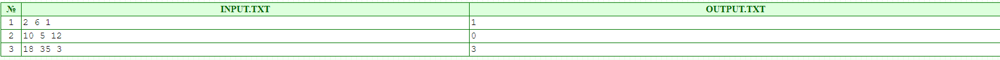
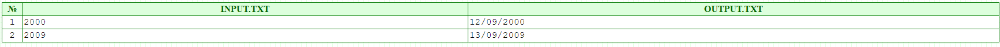

# Tasks from acmp

+ [Lesson 1. Неглухой телефон](#ACMP-Lesson-1) ![icon][done] 
+ [Lesson 2. A+B](#ACMP-Lesson-2) ![icon][done]
+ [Lesson 3. Бисер](#ACMP-Lesson-3) ![icon][done]
+ [Lesson 4. Спирт](#ACMP-Lesson-4) ![icon][done]
+ [Lesson 5. День программиста](#ACMP-Lesson-5) ![icon][done]
+ [Lesson 6. Орфография](#ACMP-Lesson-6) ![icon][done]
+ [Lesson 7. Расшифровка](#ACMP-Lesson-7) ![icon][done]
+ [Lesson 8. Нули](#ACMP-Lesson-8) ![icon][done]
+ [Lesson 9. Сжатие бинарных последовательностей](#ACMP-Lesson-9) ![icon][done]
+ [Lesson 10. Арифметическая прогрессия](#ACMP-Lesson-10) ![icon][done]
+ [Lesson 11. Внеземные гости](#ACMP-Lesson-11) ![icon][done]
+ [Lesson 12. Время прибытия](#ACMP-Lesson-12) ![icon][done]
+ [Lesson 13. Головоломка про ферзей](#ACMP-Lesson-13) ![icon][done]
+ [Lesson 14. Ролевая игра](#ACMP-Lesson-14) ![icon][done]
+ [Lesson 15. Номера автобусов](#ACMP-Lesson-15) ![icon][done]

[Список разделов](README.md)

[done]:src/main/resources/image/done.png

## ACMP Lesson 1 

Неглухой телефон
-
(Время: 1 сек. Память: 16 Мб Сложность: 1%) 
Возможно, что Вы когда то играли в игру «Глухой телефон», либо слышали о ней. В этой игре участникам приходится передавать информацию друг другу различными способами: словесно, образно, бывает даже приходится писать левой рукой текст, который другой участник команды должен будет прочитать. Так же известно, что практически никогда передаваемая информация не доходит до конечного адресата. Обозначим за Fi(x) функцию, которая преобразует текст передаваемой информации x в ту, которую получит участник i+1 от участника i. Тогда последний n-й участник получит данные y, которые будут выражаться следующей формулой:

y = Fn-1(Fn-2(…F2(F1(x))))

Но Вам необходимо исключить какие-либо внешние факторы, которые могут исказить исходную информацию и Вы должны реализовать программу «неглухой телефон», которая сможет безошибочно доставлять исходные данные, т.е. в нашем случае функция Fi(x) = x для всех i от 1 до n-1.

Входные данные 
В единственной строке входного файла INPUT.TXT записано натуральное число от 1 до 100.

Выходные данные 
В выходной файл OUTPUT.TXT нужно вывести в точности то же число, которое задано во входном файле.

Пример

[к оглавлению](#Tasks-from-acmp)

## ACMP Lesson 2

A+B
-
(Время: 1 сек. Память: 16 Мб Сложность: 2%) 
Требуется сложить два целых числа А и В.

Входные данные 
В единственной строке входного файла INPUT.TXT записаны два натуральных числа через пробел. Значения чисел не превышают 109.

Выходные данные 
В единственную строку выходного файла OUTPUT.TXT нужно вывести одно целое число — сумму чисел А и В.

Пример

[к оглавлению](#Tasks-from-acmp)

## ACMP Lesson 3

Бисер
-
(Время: 1 сек. Память: 16 Мб Сложность: 2%) 
В шкатулке хранится разноцветный бисер (или бусины). Все бусины имеют одинаковую форму, размер и вес. Бусины могут быть одного из N различных цветов. В шкатулке много бусин каждого цвета.

Требуется определить минимальное число бусин, которые можно не глядя вытащить из шкатулки так, чтобы среди них гарантированно были две бусины одного цвета.

Входные данные 
Входной файл INPUT.TXT содержит одно натуральное число N - количество цветов бусин (1 ≤ N ≤ 109).

Выходные данные 
В выходной файл OUTPUT.TXT выведите ответ на поставленную задачу.

Пример

[к оглавлению](#Tasks-from-acmp)

## ACMP Lesson 4

Спирт
-
(Время: 1 сек. Память: 16 Мб Сложность: 10%) 
Каждому школьнику из курса органической химии известна формула молекулы этилового спирта – C2H5(OH). Откуда видно, что молекула спирта состоит из двух атомов углерода (C), шести атомов водорода (H) и одного атома кислорода (O).

По заданному количеству атомов каждого из описанных выше элементов требуется определить максимально возможное количество молекул спирта, которые могут образоваться в процессе их соединения.

Входные данные 
Первая строка входного файла INPUT.TXT содержит 3 натуральных числа: C, Н и O – количество атомов углерода, водорода и кислорода соответственно. Все числа разделены пробелом и не превосходят 1018.

Выходные данные 
В выходной файл OUTPUT.TXT выведите максимально возможное число молекул спирта, которые могут получиться из атомов, представленных во входных данных.

Примеры

[к оглавлению](#Tasks-from-acmp)

## ACMP Lesson 5

День программиста
-
(Время: 1 сек. Память: 16 Мб Сложность: 13%) 
День программиста отмечается в 255-й день года (при этом 1 января считается нулевым днем). Требуется написать программу, которая определит дату (месяц и число григорианского календаря), на которую приходится День программиста в заданном году.

В григорианском календаре високосным является: 

год, номер которого делится нацело на 400 
год, номер которого делится на 4, но не делится на 100 
Входные данные 
В единственной строке входного файла INPUT.TXT записано целое число от 1 до 9999 включительно, которое обозначает номер года нашей эры.

Выходные данные 
В единственную строку выходного файла OUTPUT.TXT нужно вывести дату Дня программиста в формате DD/MM/YYYY, где DD — число, MM — номер месяца (01 — январь, 02 — февраль, ..., 12 — декабрь), YYYY — год в десятичной записи.

Примеры

[к оглавлению](#Tasks-from-acmp)

## ACMP Lesson 6

Орфография
-
(Время: 1 сек. Память: 16 Мб Сложность: 13%) 
У студента-филолога Васи есть замечательный друг Петя. И Петя никак не может выучить английский язык. Английский текст Петя еще кое-как читает, но пишет с ужасными ошибками, причем чаще всего он вставляет в слова лишние буквы.

Вася решил помочь Пете. Теперь каждый день Вася диктует Пете слова, а Петя их записывает. После семестра занятий Петя стал писать много лучше и теперь делает в словах только по одной ошибке. Чтобы автоматизировать процесс исправления ошибок, Вася просит Вас написать программу, которая удаляет из слова одну лишнюю букву и показывает Пете правильное слово.

Входные данные 
Входной файл INPUT.TXT содержит целое число K - номер лишней буквы, а затем через один или несколько пробелов записано слово S, состоящее из английских букв верхнего регистра. Гарантируется, что номер буквы не превышает длину слова. Длина слова не более 80 символов.

Выходные данные 
В выходной файл OUTPUT.TXT выведите исправленное слово.

Примеры

[к оглавлению](#Tasks-from-acmp)

## ACMP Lesson 7

Расшифровка
-
(Время: 1 сек. Память: 16 Мб Сложность: 28%) 
Рассмотрим работу простейшего шифра. Шифруемое сообщение состоит из английских букв, записанных в нижнем регистре и символа пробела. Шифрование происходит посимвольно. Каждой букве ставим в соответствие число: a – 1, b – 2, … , z – 26, ‘ ‘ – 27. Далее индекс символа складывается с номером в сообщении по модулю 27, а результат сложения представляется в системе счисления с основанием 27 (0, 1, …, Q в верхнем регистре).

Необходимо написать дешифратор. 

Входные данные 
В единственной строке входного файла INPUT.TXT содержится закодированная строка, длиной от 1 до 255 символов. Строка записана в верхнем регистре.

Выходные данные 
В единственную строку выходного файла OUTPUT.TXT нужно вывести расшифровку заданной строки, при этом символы английского алфавита следует выводить в нижнем регистре.

В позиционной системе счисления с основанием 27 для записи любого числа используются цифры 0–9 и буквы латинского алфавита A–Q.
Пример: в системе с основанием 27 десятичное число двадцать шесть записывается как Q и двадцать семь записывается как 10.

Примеры

[к оглавлению](#Tasks-from-acmp)

## ACMP Lesson 8

Нули
-
(Время: 1 сек. Память: 16 Мб Сложность: 16%) 
Требуется найти самую длинную непрерывную цепочку нулей в последовательности нулей и единиц.

Входные данные 
В единственной строке входного файла INPUT.TXT записана последовательность нулей и единиц (без пробелов). Суммарное количество цифр от 1 до 100.

Выходные данные 
В единственную строку выходного файла OUTPUT.TXT нужно вывести искомую длину цепочки нулей.

Пример

[к оглавлению](#Tasks-from-acmp)

## ACMP Lesson 9

Сжатие бинарных последовательностей
-
(Время: 1 сек. Память: 16 Мб Сложность: 19%) 
Последовательность из символов «0» и «1» называется бинарной. Они широко применяются в информатике и других науках. Одно из неудобств бинарных последовательностей – их трудно запоминать. Для решения этой проблемы были предложены разные способы их сжатия. Программист Слава использует следующий способ: просматривая последовательность слева направо, он заменяет «1» на «a», «01» на «b», «001» на «c», …, «00000000000000000000000001» на «z». Напишите программу, которая поможет Славе автоматизировать этот способ сжатия.

Входные данные 
Входной файл INPUT.TXT содержит бинарную последовательность – строку из символов «0» и «1» длиной не более 255 символов. Гарантируется, что к ней применим указанный способ сжатия.

Выходные данные 
В выходной файл OUTPUT.TXT выведите одну строку из английских строчных букв от «a» до «z» – сжатие заданной бинарной последовательности.

Примеры

[к оглавлению](#Tasks-from-acmp)

## ACMP Lesson 10

Арифметическая прогрессия
-
(Время: 1 сек. Память: 16 Мб Сложность: 15%) 
Заданы первый и второй элементы арифметической прогрессии. Требуется написать программу, которая вычислит элемент прогрессии по ее номеру.

Входные данные 
Входной файл INPUT.TXT содержит три целых числа, разделенных пробелами – первый элемент прогрессии A1 (1 ≤ A1 ≤ 1000), второй элемент прогрессии A2 (1 ≤ A2 ≤ 1000), и номер требуемого элемента N (1 ≤ N ≤ 1000).

Выходные данные 
Выходной файл OUTPUT.TXT должен содержать одно целое число - N-й элемент арифметической прогрессии.

Пример 

Пояснение к примеру 
Здесь речь идет о следующей последовательности чисел: 

1, 5, 9, 13, 17, 21, … 
В данной последовательности D=4, поэтому A1=1, A2=A1+D=5, A3=A1+2*D=9, и т.д. Поскольку нам нужно было найти 3й элемент прогрессии, то ответом на задачу является число 9.

[к оглавлению](#Tasks-from-acmp)

## ACMP Lesson 11 

Внеземные гости (10% сложность)
-
Недавно на поле фермера Джона были обнаружены следы приземления летающих тарелок. Об этом даже писала газета Mew Yorc Courier.

Поле фермера Джона имеет форму круга радиусом r1. По сообщениям журналистов были обнаружены два следа от летающих тарелок, имевшие форму кругов. Один из них имел радиус r2, второй - радиус r3. Также сообщается, что они находились внутри поля фермера Джона и не пересекались, ни один из них не лежал внутри другого. При этом, они, возможно, касались друг друга и/или границы поля.

Поскольку журналисты часто склонны преувеличивать масштабы событий, необходимо написать программу, которая будет проверять, могли ли иметь место события, описанные в газете.

Входные данные 
Входной файл INPUT.TXT содержит три целых положительных числа - r1, r2, r3 (1 ≤ r1, r2, r3 ≤ 109).

Выходные данные 
В выходной файл OUTPUT.TXT выведите слово YES, если информация, опубликованная в газете, может соответствовать правде, и слово NO - иначе.

Примеры

[к оглавлению](#Tasks-from-acmp)

## ACMP Lesson 12

Время прибытия (15% сложность)
-
Задано время отправления поезда и время в пути до конечной станции. Требуется написать программу, которая найдет время прибытия этого поезда (возможно, в другие сутки).

Входные данные 
Входной файл INPUT.TXT содержит две строки. В первой строке задано время отправления, а во второй строке – время в пути. Время отправления задается в формате «HH:MM», где HH время в часах, которое принимает значение от 00 до 23, ММ – время в минутах, которое принимает значение от 00 до 59. Время в пути задается двумя неотрицательными целыми числами – количество часов и количество минут. Числа разделяются одним пробелом. Количество часов не превышает 120, минут – 59.

Выходные данные 
Выходной файл OUTPUT.TXT должен содержать одну строку – время прибытия поезда на конечную станцию. Формат вывода этого времени совпадает с форматом ввода времени отправления.

Примеры

## ACMP Lesson 13

Головоломка про ферзей (15% сложность)
-
Вероятно, что многие из вас играли в шахматы. Поэтому вы знаете, что ферзь может двигаться по горизонталям, вертикалям и диагоналям.

Вася недавно начал заниматься шахматами и где-то прочел головоломку, в которой нужно было расставить максимальное количество ферзей на доске 8х8 так, чтобы хотя бы одно поле оказалось небитым. Эта задача легко решается для доски 3х3, т.к. понятно, что более двух ферзей расставить таким образом на ней невозможно.

Помогите Васе решить эту задачу для доски N×N.

Входные данные 
В единственной строке входного файла INPUT.TXT записано натуральное число N – размеры шахматной доски N×N (1 ≤ N ≤ 100).

Выходные данные 
В единственную строку выходного файла OUTPUT.TXT нужно вывести максимальное количество ферзей, которых можно расставить на шахматной доске N×N так, чтобы одна клетка оставалась небитой.

Пример

## ACMP Lesson 14

Ролевая игра (15% сложность)
-
Вася готовит инвентарь для ролевой игры. В игре должны принять участие n игроков, каждый из которых будет изображать персонажа фантастического мира. В процессе игры каждый персонаж будет обладать некоторым уровнем x, который представляет собой целое число от 1 до m.

Для обозначения уровня планируется использовать специальные значки двух цветов. Белый значок обозначает один уровень, а красный значок – k уровней. Игрок, изображающий персонажа с уровнем x, должен иметь a белых значков и b красных значков, чтобы сумма (a + b*k) была равна x. При этом персонажу не разрешается иметь более чем (k – 1) белых значков.

Значки для игры готовятся заранее, однако уровни персонажей заранее неизвестны. Для успешного проведения игры всем персонажам необходимо выдать соответствующее их уровням количество значков. Возникает вопрос: какое минимальное суммарное количество значков необходимо подготовить для успешного проведения игры при любых уровнях участвующих персонажей.

Требуется написать программу, которая по заданным числам n, m и k вычисляет минимальное количество значков, которое необходимо подготовить для успешного проведения игры.

Входные данные 
Входной файл INPUT.TXT содержит расположенные в одной строке три целых числа: n, m и k (1 ≤ n ≤ 104, 1 ≤ m ≤ 105, 1 ≤ k ≤ 105).

Выходные данные 
В выходной файл OUTPUT.TXT выведите одно целое число — минимальное количество значков, которое требуется подготовить.

Пример

## ACMP Lesson 15

Номера автобусов (16% сложность)
-
Однажды Вася очень долго просидел на остановке, прежде чем дождался своего автобуса. Чтобы как-то занять время, он решил записывать на листочке государственные регистрационные номера проходящих мимо автобусов, следующих по другому маршруту, нежели нужен был Васе. При этом производилась запись лишь основного номера, без учета региональной принадлежности. В итоге Васе удалось записать N таких номеров.

Основная часть государственного регистрационного номера состоит из 6 символов: трех букв и трех цифр. Сначала идет буква, затем 3 цифры и еще 2 буквы заканчивают запись. В качестве цифр могут использоваться любые цифры от 0 до 9, а в качестве букв только прописные буквы, обозначения которых присутствуют как в английском, так и в русском алфавите, т.е. только следующие символы: A, B, C, E, H, K, M, O, P, T, X, Y. Например, «P204BT» - правильный номер, а «X182YZ» и «ABC216» - нет.

Ваша задача заключается в проверке правильности проделанной Васей работы. А именно, нужно определить, какие из номеров соответствуют принятому стандарту, а какие нет.

Входные данные 
Первая строка входного файла INPUT.TXT содержит единственное натуральное число N – количество записанных Васей номеров (N ≤ 50). Далее следует N строк с записями номеров автобусов. Длины строк от 1 до 300 и содержат только символы с кодами ASCII от 33 до 127 (не содержат пробелов, специальных и русских символов).

Выходные данные 
В выходной файл OUTPUT.TXT выведите N строк, в i-й строке должно содержаться «Yes», если соответствующая i-я запись номера верна и «No» в противном случае.

Пример

