# Tasks from leetcode

+ [Lesson 1. 1961.Check If String Is a Prefix of Array](#Leetcode-Lesson-1) ![icon][done]
+ [Lesson 2. Group Anagrams](#Leetcode-Lesson-2) ![icon][done]
+ [Lesson 3. Plus One](#Leetcode-Lesson-3) ![icon][done]
+ [Lesson 4. Container With Most Water](#Leetcode-Lesson-4) ![icon][done]
+ [Lesson 5. Longest Common Prefix](#Leetcode-Lesson-5) ![icon][done]
+ [Lesson 6. Palindrome Number](#Leetcode-Lesson-6) ![icon][done]
+ [Lesson 7. Two Sum](#Leetcode-Lesson-7) ![icon][done]
+ [Lesson 8. Reverse Integer](#Leetcode-Lesson-8) ![icon][done]
+ [Lesson 9. Reverse String](#Leetcode-Lesson-9) ![icon][done]
+ [Lesson 10. Fibonacci Number](#Leetcode-Lesson-10) ![icon][done]
+ [Lesson 11. Power of Two](#Leetcode-Lesson-11) ![icon][done]
+ [Lesson 12. Contains Duplicate](#Leetcode-Lesson-12) ![icon][done]
+ [Lesson 13. Length of Last Word](#Leetcode-Lesson-13) ![icon][done]
+ [Lesson 14. Valid Parentheses](#Leetcode-Lesson-14) ![icon][done]
+ [Lesson 15. Remove Duplicates from Sorted List](#Leetcode-Lesson-15) ![icon][done]
+ [Lesson 16. Remove Element](#Leetcode-Lesson-16) ![icon][done]
+ [Lesson 17. Base 7](#Leetcode-Lesson-17) ![icon][done]
+ [Lesson 18. Single Number](#Leetcode-Lesson-18) ![icon][done]
+ [Lesson 19. Majority Element](#Leetcode-Lesson-19) ![icon][done]
+ [Lesson 20. 1920.Build Array from Permutation](#Leetcode-Lesson-20) ![icon][done]
+ [Lesson 21. Valid Sudoku](#Leetcode-Lesson-21) ![icon][done]
+ [Lesson 22. Split Linked List in Parts](#Leetcode-Lesson-22) ![icon][done]
+ [Lesson 23. Keyboard Row](#Leetcode-Lesson-23) ![icon][done]
+ [Lesson 24. Fizz Buzz](#Leetcode-Lesson-24) ![icon][done]
+ [Lesson 25. Day of the Week](#Leetcode-Lesson-25) ![icon][done]
+ [Lesson 26. Check If N and Its Double Exist](#Leetcode-Lesson-26) ![icon][done]
+ [Lesson 27. Roman to Integer](#Leetcode-Lesson-27) ![icon][done]
+ [Lesson 28. Merge Two Sorted Lists](#Leetcode-Lesson-28) ![icon][done]
+ [Lesson 29. Remove Duplicates from Sorted Array](#Leetcode-Lesson-29) ![icon][done]
+ [Lesson 30. Implement strStr()](#Leetcode-Lesson-30) ![icon][done]
+ [Lesson 31. Maximum Subarray](#Leetcode-Lesson-31) ![icon][done]
+ [Lesson 32. Sqrt(x)](#Leetcode-Lesson-32) ![icon][done]
+ [Lesson 33. Climbing Stairs](#Leetcode-Lesson-33) ![icon][done]
+ [Lesson 34. Merge Sorted Array](#Leetcode-Lesson-34) ![icon][done]
+ [Lesson 35. Binary Tree Inorder Traversal](#Leetcode-Lesson-35) ![icon][done]
+ [Lesson 36. Pascal's Triangle](#Leetcode-Lesson-36) ![icon][done]
+ [Lesson 37. Delete Node in a Linked List](#Leetcode-Lesson-37) ![icon][done]
+ [Lesson 38. Best Time to Buy and Sell Stock](#Leetcode-Lesson-38) ![icon][done]
+ [Lesson 39. Valid Palindrome](#Leetcode-Lesson-39) ![icon][done]
+ [Lesson 40. Missing Number](#Leetcode-Lesson-40) ![icon][done]
+ [Lesson 41. Min Stack](#Leetcode-Lesson-41) ![icon][done]
+ [Lesson 42. Excel Sheet Column Number](#Leetcode-Lesson-42) ![icon][done]
+ [Lesson 43. Move Zeroes](#Leetcode-Lesson-43) ![icon][done]
+ [Lesson 44. First Unique Character in a String](#Leetcode-Lesson-44) ![icon][done]
+ [Lesson 45. Happy Number](#Leetcode-Lesson-45) ![icon][done]
+ [Lesson 46. Intersection of Two Arrays II](#Leetcode-Lesson-46) ![icon][done]
+ [Lesson 47. Reverse Bits](#Leetcode-Lesson-47) ![icon][done]
+ [Lesson 48. Contains Duplicate II](#Leetcode-Lesson-48) ![icon][done]
+ [Lesson 49. Island Perimeter](#Leetcode-Lesson-49) ![icon][done]
+ [Lesson 50. Valid Anagram](#Leetcode-Lesson-50) ![icon][done]
+ [Lesson 51. 1114 Print in Order](#Leetcode-Lesson-51) ![icon][done]
+ [Lesson 52. 1768. Merge Strings Alternately](#Leetcode-Lesson-52) ![icon][done]
+ [Lesson 53. 2405. Optimal Partition of String](#Leetcode-Lesson-53) ![icon][done]
+ [Lesson 54. 35. Search Insert Position](#Leetcode-Lesson-54) ![icon][done]
+ [Lesson 55. 22 Generate Parentheses](#Leetcode-Lesson-55) ![icon][done]
+ [Lesson 56. 258 Add Digits](#Leetcode-Lesson-56) ![icon][done]
+ [Lesson 57. 111 Minimum Depth of Binary Tree](#Leetcode-Lesson-57) ![icon][done]
+ [Lesson 58. 2. Add Two Numbers](#Leetcode-Lesson-58) ![icon][done]
+ [Lesson 59. 230. Kth Smallest Element in a BST](#Leetcode-Lesson-59) ![icon][done]
+ [Lesson 60. 797. All Paths From Source to Target](#Leetcode-Lesson-60) ![icon][done]
+ [Lesson 61. 75. Sort Colors](#Leetcode-Lesson-61) ![icon][done]
+ [Lesson 62. 5. Longest Palindromic Substring](#Leetcode-Lesson-62) ![icon][done]
+ [Lesson 63. 67. Add Binary](#Leetcode-Lesson-63) ![icon][done]
+ [Lesson 64. 3. Longest Substring Without Repeating Characters](#Leetcode-Lesson-64) ![icon][done]
+ [Lesson 65. 100. Same Tree](#Leetcode-Lesson-65) ![icon][done]
+ [Lesson 66. 852 Peak Index in a Mountain Array](#Leetcode-Lesson-66) ![icon][done]
+ [Lesson 67 263. Ugly Number](#Leetcode-Lesson-67) ![icon][done]
+ [Lesson 68 101. Symmetric Tree](#Leetcode-Lesson-68) ![icon][done]
+ [Lesson 69 104. Maximum Depth of Binary Tree](#Leetcode-Lesson-69) ![icon][done]
+ [Lesson 70 134. Gas Station](#Leetcode-Lesson-70) ![icon][done]
+ [Lesson 71 222. Count Complete Tree Nodes](#Leetcode-Lesson-71) ![icon][done]
+ [Lesson 72 226. Invert Binary Tree](#Leetcode-Lesson-72) ![icon][done]
+ [Lesson 73 953. Verifying an Alien Dictionary](#Leetcode-Lesson-73) ![icon][done]
+ [Lesson 74 116. Populating Next Right Pointers in Each Node](#Leetcode-Lesson-74) ![icon][done]
+ [Lesson 75 2032. Two Out of Three](#Leetcode-Lesson-75) ![icon][done]
+ [Lesson 76 52. N-Queens II](#Leetcode-Lesson-76) ![icon][done]
+ [Lesson 77 146. LRU Cache](#Leetcode-Lesson-77) ![icon][done]
+ [Lesson 78 401. Binary Watch](#Leetcode-Lesson-78) ![icon][done]
+ [Lesson 79 20. Valid Parentheses](#Leetcode-Lesson-79) ![icon][done]
+ [Lesson 80 572. Subtree of Another Tree](#Leetcode-Lesson-80) ![icon][done]
+ [Lesson 81 507. Perfect Number](#Leetcode-Lesson-81) ![icon][done]
+ [Lesson 82 643. Maximum Average Subarray I](#Leetcode-Lesson-82) ![icon][done]
+ [Lesson 83 142. Linked List Cycle II](#Leetcode-Lesson-83) ![icon][done]
+ [Lesson 84 108. Convert Sorted Array to Binary Search Tree](#Leetcode-Lesson-84) ![icon][done]


[Список разделов](README.md)

[done]:src/main/resources/image/done.png
[142. Linked List Cycle II]:src/main/java/com/oshovskii/practice/leetcode/medium/lesson83/LinkedListCycleIISolution.java
[108. Convert Sorted Array to Binary Search Tree]:src/main/java/com/oshovskii/practice/leetcode/easy/lesson84/ConvertSortedArrayToBinarySearchTreeSolution.java

## Leetcode Lesson 1 

1961.Check If String Is a Prefix of Array (Easy)
-
Given a string `s` and an array of strings words, determine whether `s` is a prefix string of words.
A string `s` is a prefix string of words if s can be made by concatenating the first `k` strings in words for some 
positive `k` no larger than words.length.
Return `true` if s is a prefix string of words, or `false` otherwise.

**Example 1:**
```java
Input: s = "iloveleetcode", words = ["i","love","leetcode","apples"]
Output: true
Explanation:
s can be made by concatenating "i", "love", and "leetcode" together.
```       

**Example 2:**
```java
Input: s = "iloveleetcode", words = ["apples","i","love","leetcode"]
Output: false
Explanation:
It is impossible to make s using a prefix of arr.
```

**Constraints:**
```java
1 <= words.length <= 100
1 <= words[i].length <= 20
1 <= s.length <= 1000
words[i] and s consist of only lowercase English letters.
```


[к оглавлению](#Tasks-from-leetcode)

## Leetcode Lesson 2 

Group Anagrams (Medium)
-
Given an array of strings strs, group the anagrams together. You can return the answer in any order.
An Anagram is a word or phrase formed by rearranging the letters of a different word or phrase, typically using all the 
original letters exactly once.

**Example 1:**
```java
Input: strs = ["eat","tea","tan","ate","nat","bat"]
Output: [["bat"],["nat","tan"],["ate","eat","tea"]]
Example 2:
```

**Example 2:**
```java
Input: strs = [""]
Output: [[""]]
Example 3:
```

**Example 3:**
```java
Input: strs = ["a"]
Output: [["a"]]
```

**Constraints:**
```java
1 <= strs.length <= 104
0 <= strs[i].length <= 100
strs[i] consists of lower-case English letters.
```

[к оглавлению](#Tasks-from-leetcode)


## Leetcode Lesson 3

Plus One (Medium)
-
Given a non-empty array of decimal digits representing a non-negative integer, increment one to the integer.
The digits are stored such that the most significant digit is at the head of the list, and each element 
in the array contains a single digit.
You may assume the integer does not contain any leading zero, except the number 0 itself.

**Example 1:**
```java
Input: digits = [1,2,3]
Output: [1,2,4]
Explanation: The array represents the integer 123.
```

**Example 2:**
```java
Input: digits = [4,3,2,1]
Output: [4,3,2,2]
Explanation: The array represents the integer 4321.
```

**Example 3:**
```java
Input: digits = [0]
Output: [1]
```

**Constraints:**
```java
1 <= digits.length <= 100
0 <= digits[i] <= 9
```


[к оглавлению](#Tasks-from-leetcode)

## Leetcode Lesson 4

Container With Most Water (Medium)
-
Given n non-negative integers a1, a2, ..., an , where each represents a point at coordinate (i, ai). n vertical lines 
are drawn such that the two endpoints of the line i is at (i, ai) and (i, 0). Find two lines, which, together with the 
x-axis forms a container, such that the container contains the most water.

Notice that you may not slant the container.

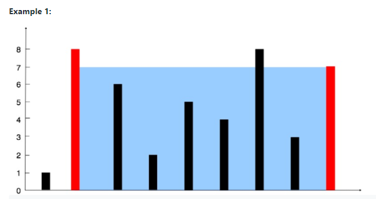</br>

**Example 1:**
```java
Input: height = [1,8,6,2,5,4,8,3,7]
Output: 49
Explanation: The above vertical lines are represented by array [1,8,6,2,5,4,8,3,7]. In this case, the max area of water (blue section) the container can contain is 49.
```


**Example 2:**
```java
Input: height = [1,1]
Output: 1
```

**Example 3:**
```java
Input: height = [4,3,2,1,4]
Output: 16
```

**Example 4:**
```java
Input: height = [1,2,1]
Output: 2
```

**Constraints:**
```java
n == height.length
2 <= n <= 105
0 <= height[i] <= 104
```

[к оглавлению](#Tasks-from-leetcode)


## Leetcode Lesson 5 

Longest Common Prefix (Easy)
-
Write a function to find the longest common prefix string amongst an array of strings.
If there is no common prefix, return an empty string "".

**Example 1:**
```java
Input: strs = ["flower","flow","flight"]
Output: "fl"
```

**Example 2:**
```java
Input: strs = ["dog","racecar","car"]
Output: ""
Explanation: There is no common prefix among the input strings.
```

**Constraints:**
```java
1 <= strs.length <= 200
0 <= strs[i].length <= 200
strs[i] consists of only lower-case English letters.
```


[к оглавлению](#Tasks-from-leetcode)

## Leetcode Lesson 6

Palindrome Number (Easy)
-
Given an integer x, return true if x is palindrome integer.
An integer is a palindrome when it reads the same backward as forward. For example, 121 is palindrome while 123 is not.

**Example 1:**
```java
Input: x = 121
Output: true
```

**Example 2:**
```java
Input: x = -121
Output: false
Explanation: From left to right, it reads -121. From right to left, it becomes 121-. Therefore it is not a palindrome.
```

**Example 3:**
```java
Input: x = 10
Output: false
Explanation: Reads 01 from right to left. Therefore it is not a palindrome.
```

**Example 4:**
```java
Input: x = -101
Output: false
```

**Constraints:**
```java
-231 <= x <= 231 - 1
```

Follow up: Could you solve it without converting the integer to a string?

[к оглавлению](#Tasks-from-leetcode)


## Leetcode Lesson 7

Two Sum (Easy)
-
Given an array of integers `nums` and an integer `target`, return indices of the two numbers such that they add up to 
`target`. You may assume that each input would have **exactly one solution**, and you may not use the same element 
twice. You can return the answer in any order.

**Example 1:**
```java
Input: nums = [2,7,11,15], target = 9
Output: [0,1]
Output: Because nums[0] + nums[1] == 9, we return [0, 1].
```

**Example 2:**
```java
Input: nums = [3,2,4], target = 6
Output: [1,2]
```

**Example 3:**
```java
Input: nums = [3,3], target = 6
Output: [0,1]
```

**Constraints:**
```java
2 <= nums.length <= 104
-109 <= nums[i] <= 109
-109 <= target <= 109
Only one valid answer exists.
```

**Follow-up:** 
Can you come up with an algorithm that is less than `O(n2)` time complexity?

[к оглавлению](#Tasks-from-leetcode)


## Leetcode Lesson 8

Reverse Integer (Easy)
-
Given a signed 32-bit integer `x`, return `x` with its digits reversed. 
If reversing `x` causes the value to go outside the signed 32-bit integer range `[-231, 231 - 1]`, then return `0`.

**Assume the environment does not allow you to store 64-bit integers (signed or unsigned).**

**Example 1:**
```java
Input: x = 123
Output: 321
```

**Example 2:**
```java
Input: x = -123
Output: -321
```

**Example 3:**
```java
Input: x = 120
Output: 21
```

**Example 4:**
```java
Input: x = 0
Output: 0
```

**Constraints:**
```java
-231 <= x <= 231 - 1
```

[к оглавлению](#Tasks-from-leetcode)


## Leetcode Lesson 9

Reverse String (Easy)
-
Write a function that reverses a string. The input string is given as an array of characters `s`.

**Example 1:**
```java
Input: s = ["h","e","l","l","o"]
Output: ["o","l","l","e","h"]
```

**Example 2:**
```java
Input: s = ["H","a","n","n","a","h"]
Output: ["h","a","n","n","a","H"]
```

**Constraints:**
```java
1 <= s.length <= 105
s[i] is a printable ascii character.
```

**Follow up:** 
Do not allocate extra space for another array. You must do this by modifying the input array in-place with O(1) 
extra memory.

[к оглавлению](#Tasks-from-leetcode)


## Leetcode Lesson 10

Fibonacci Number (Easy)
-
The **Fibonacci numbers**, commonly denoted `F(n)` form a sequence, called the **Fibonacci sequence**, 
such that each number is the sum of the two preceding ones, starting from `0` and `1`. That is,
```java
F(0) = 0, F(1) = 1
F(n) = F(n - 1) + F(n - 2), for n > 1.
Given n, calculate F(n).
```

**Example 1:**
```java
Input: n = 2
Output: 1
Explanation: F(2) = F(1) + F(0) = 1 + 0 = 1.
```

**Example 2:**
```java
Input: n = 3
Output: 2
Explanation: F(3) = F(2) + F(1) = 1 + 1 = 2.
```

**Example 3:**
```java
Input: n = 4
Output: 3
Explanation: F(4) = F(3) + F(2) = 2 + 1 = 3.
```

**Constraints:**
```java
0 <= n <= 30
```

[к оглавлению](#Tasks-from-leetcode)


## Leetcode Lesson 11

Power of Two (Easy)
-
Given an integer `n`, return `true` if it is a power of two. Otherwise, return `false`.
An integer `n` is a power of two, if there exists an integer `x` such that `n == 2x`.

**Example 1:**
```java
Input: n = 1
Output: true
Explanation: 20 = 1
```

**Example 2:**
```java
Input: n = 16
Output: true
Explanation: 24 = 16
```

**Example 3:**
```java
Input: n = 3
Output: false
```

**Example 4:**
```java
Input: n = 4
Output: true
```

**Example 5:**
```java
Input: n = 5
Output: false
```

**Constraints:**
```java
-231 <= n <= 231 - 1
```


[к оглавлению](#Tasks-from-leetcode)


## Leetcode Lesson 12

Contains Duplicate (Easy)
-
Given an integer array `nums`, return `true` if any value appears **at least twice** in the array, and return `false` 
if every element is distinct.

**Example 1:**
```java
Input: nums = [1,2,3,1]
Output: true
```

**Example 2:**
```java
Input: nums = [1,2,3,4]
Output: false
```

**Example 3:**
```java
Input: nums = [1,1,1,3,3,4,3,2,4,2]
Output: true
```

**Constraints:**
```java
1 <= nums.length <= 105
-109 <= nums[i] <= 109
```

[к оглавлению](#Tasks-from-leetcode)


## Leetcode Lesson 13

Length of Last Word (Easy)
-
Given a string `s` consisting of some words separated by some number of spaces, return the length of the **last** 
word in the string. A **word** is a maximal substring consisting of non-space characters only.

**Example 1:**
```java
Input: s = "Hello World"
Output: 5
Explanation: The last word is "World" with length 5.
```

**Example 2:**
```java
Input: s = "   fly me   to   the moon  "
Output: 4
Explanation: The last word is "moon" with length 4.
```

**Example 3:**
```java
Input: s = "luffy is still joyboy"
Output: 6
Explanation: The last word is "joyboy" with length 6.
```

**Constraints:**
```java
1 <= s.length <= 104
s consists of only English letters and spaces ' '.
There will be at least one word in s.
```

[к оглавлению](#Tasks-from-leetcode)


## Leetcode Lesson 14

Valid Parentheses (Easy)
-
Given a string `s` containing just the characters `'('`, `')'`, `'{'`, `'}'`, `'['` and `']'`, determine if the input 
string is valid.

An input string is valid if:

1. Open brackets must be closed by the same type of brackets.
2. Open brackets must be closed in the correct order.

**Example 1:**
```java
Input: s = "()"
Output: true
```

**Example 2:**
```java
Input: s = "()[]{}"
Output: true
```

**Example 3:**
```java
Input: s = "(]"
Output: false
```

**Example 4:**
```java
Input: s = "([)]"
Output: false
```

**Example 5:**
```java
Input: s = "{[]}"
Output: true
```

**Constraints:**
```java
1 <= s.length <= 104
s consists of parentheses only '()[]{}'.
```

[к оглавлению](#Tasks-from-leetcode)


## Leetcode Lesson 15

Remove Duplicates from Sorted List (Easy)
-
Given the `head` of a sorted linked list, delete all duplicates such that each element appears only once. 
Return the linked list **sorted** as well.

**Example 1:**</br>
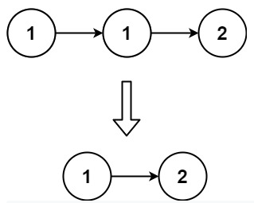
```java
Input: head = [1,1,2]
Output: [1,2]
```

**Example 2:**</br>
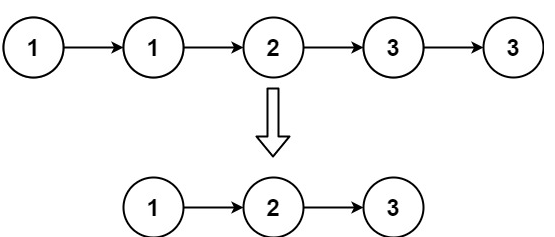
```java
Input: head = [1,1,2,3,3]
Output: [1,2,3]
```

**Constraints:**
```java
The number of nodes in the list is in the range [0, 300].
-100 <= Node.val <= 100
The list is guaranteed to be sorted in ascending order.
```

[к оглавлению](#Tasks-from-leetcode)


## Leetcode Lesson 16

Remove Element (Easy)
-
Given an integer array `nums` and an integer `val`, remove all occurrences of `val` in `nums` **in-place**. 
The relative order of the elements may be changed.</br>Since it is impossible to change the length of the array in 
some languages, you must instead have the result be placed in the **first part** of the array `nums`. More formally, 
if there are `k` elements after removing the duplicates, then the first `k` elements of `nums` should hold the final 
result. It does not matter what you leave beyond the first `k` elements.</br>
Return `k` after placing the final result in the first `k` slots of `nums`.</br>

Do **not** allocate extra space for another array. You must do this by **modifying the input array in-place** 
with O(1) extra memory.

**Custom Judge:**

The judge will test your solution with the following code:
```java
int[] nums = [...]; // Input array
int val = ...; // Value to remove
int[] expectedNums = [...]; // The expected answer with correct length.
                            // It is sorted with no values equaling val.

int k = removeElement(nums, val); // Calls your implementation

assert k == expectedNums.length;
sort(nums, 0, k); // Sort the first k elements of nums
for (int i = 0; i < actualLength; i++) {
    assert nums[i] == expectedNums[i];
}
```
If all assertions pass, then your solution will be **accepted**.

**Example 1:**
```java
Input: nums = [3,2,2,3], val = 3
Output: 2, nums = [2,2,_,_]
Explanation: Your function should return k = 2, with the first two elements of nums being 2.
It does not matter what you leave beyond the returned k (hence they are underscores).
```

**Example 2:**
```java
Input: nums = [0,1,2,2,3,0,4,2], val = 2
Output: 5, nums = [0,1,4,0,3,_,_,_]
Explanation: Your function should return k = 5, with the first five elements of nums containing 0, 0, 1, 3, and 4.
Note that the five elements can be returned in any order.
It does not matter what you leave beyond the returned k (hence they are underscores).
```

**Constraints:**
```java
0 <= nums.length <= 100
0 <= nums[i] <= 50
0 <= val <= 100
```

[к оглавлению](#Tasks-from-leetcode)


## Leetcode Lesson 17

Base 7 (Easy)
-
Given an integer `num`, return a string of its **base 7** representation.

**Example 1:**
```java
Input: num = 100
Output: "202"
```

**Example 2:**
```java
Input: num = -7
Output: "-10"
```

**Constraints:**
```java
-107 <= num <= 107
```

[к оглавлению](#Tasks-from-leetcode)


## Leetcode Lesson 18

Single Number (Easy)
-
Given a **non-empty** array of integers `nums`, every element appears twice except for one. Find that single one.
You must implement a solution with a linear runtime complexity and use only constant extra space.

**Example 1:**
```java
Input: nums = [2,2,1]
Output: 1
```

**Example 2:**
```java
Input: nums = [4,1,2,1,2]
Output: 4
```

**Example 3:**
```java
Input: nums = [1]
Output: 1
```

**Constraints:**
```java
1 <= nums.length <= 3 * 104
-3 * 104 <= nums[i] <= 3 * 104
Each element in the array appears twice except for one element which appears only once.
```

[к оглавлению](#Tasks-from-leetcode)


## Leetcode Lesson 19

Majority Element (Easy) 
-
Given an array `nums` of size `n`, return the majority element.
The majority element is the element that appears more than `⌊n / 2⌋` times. You may assume that the majority element 
always exists in the array.

**Example 1:**
```java
Input: nums = [3,2,3]
Output: 3
```

**Example 2:**
```java
Input: nums = [2,2,1,1,1,2,2]
Output: 2
```

**Constraints:**
```java
n == nums.length
1 <= n <= 5 * 104
-231 <= nums[i] <= 231 - 1
```

[к оглавлению](#Tasks-from-leetcode)


## Leetcode Lesson 20

1920.Build Array from Permutation (Easy)
-

Given a **zero-based permutation** `nums` (**0-indexed**), build an array `ans` of the **same length** where 
`ans[i] = nums[nums[i]]` for each `0 <= i < nums.length` and return it. A **zero-based permutation** `nums` is an array 
of **distinct** integers from `0` to `nums.length - 1` (**inclusive**).

**Example 1:**
```java
Input: nums = [0,2,1,5,3,4]
Output: [0,1,2,4,5,3]
Explanation: The array ans is built as follows:
ans = [nums[nums[0]], nums[nums[1]], nums[nums[2]], nums[nums[3]], nums[nums[4]], nums[nums[5]]]
= [nums[0], nums[2], nums[1], nums[5], nums[3], nums[4]]
= [0,1,2,4,5,3]
```

**Example 2:**
```java
Input: nums = [5,0,1,2,3,4]
Output: [4,5,0,1,2,3]
Explanation: The array ans is built as follows:
ans = [nums[nums[0]], nums[nums[1]], nums[nums[2]], nums[nums[3]], nums[nums[4]], nums[nums[5]]]
= [nums[5], nums[0], nums[1], nums[2], nums[3], nums[4]]
= [4,5,0,1,2,3]
```

**Constraints:**
```java
1 <= nums.length <= 1000
0 <= nums[i] < nums.length
The elements in nums are distinct.
```

**Follow-up:** 
Can you solve it without using an extra space (i.e., `O(1)` memory)?

[к оглавлению](#Tasks-from-leetcode)


## Leetcode Lesson 21

Valid Sudoku (Medium)
-
Determine if a `9 x 9` Sudoku board is valid. Only the filled cells need to be validated **according to the following rules**:

1. Each row must contain the digits `1-9` without repetition.
2. Each column must contain the digits `1-9` without repetition.
3. Each of the nine `3 x 3` sub-boxes of the grid must contain the digits `1-9` without repetition.
Note:

A Sudoku board (partially filled) could be valid but is not necessarily solvable.
Only the filled cells need to be validated according to the mentioned rules.

**Example 1:**</br>
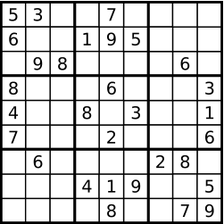

```java
Input: board =
[["5","3",".",".","7",".",".",".","."]
,["6",".",".","1","9","5",".",".","."]
,[".","9","8",".",".",".",".","6","."]
,["8",".",".",".","6",".",".",".","3"]
,["4",".",".","8",".","3",".",".","1"]
,["7",".",".",".","2",".",".",".","6"]
,[".","6",".",".",".",".","2","8","."]
,[".",".",".","4","1","9",".",".","5"]
,[".",".",".",".","8",".",".","7","9"]]
Output: true
```

**Example 2:**
```java
Input: board =
[["8","3",".",".","7",".",".",".","."]
,["6",".",".","1","9","5",".",".","."]
,[".","9","8",".",".",".",".","6","."]
,["8",".",".",".","6",".",".",".","3"]
,["4",".",".","8",".","3",".",".","1"]
,["7",".",".",".","2",".",".",".","6"]
,[".","6",".",".",".",".","2","8","."]
,[".",".",".","4","1","9",".",".","5"]
,[".",".",".",".","8",".",".","7","9"]]
Output: false
```
Explanation: Same as Example 1, except with the 5 in the top left corner being modified to 8. Since there are two 8's 
in the top left 3x3 sub-box, it is invalid.


**Constraints:**
```java
board.length == 9
board[i].length == 9
board[i][j] is a digit 1-9 or '.'.
```

[к оглавлению](#Tasks-from-leetcode)


## Leetcode Lesson 22

Split Linked List in Parts (Medium)
-
Given the `head` of a singly linked list and an integer `k`, split the linked list into `k` consecutive linked list parts.
The length of each part should be as equal as possible: no two parts should have a size differing by more than one. This may lead to some parts being null.
The parts should be in the order of occurrence in the input list, and parts occurring earlier should always have a size greater than or equal to parts occurring later.
Return an array of the `k` parts.

**Example 1:**</br>
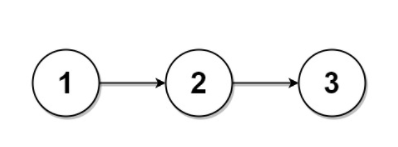

```java
Input: head = [1,2,3], k = 5
Output: [[1],[2],[3],[],[]]
Explanation:
The first element output[0] has output[0].val = 1, output[0].next = null.
The last element output[4] is null, but its string representation as a ListNode is [].
```

**Example 2:**</br>
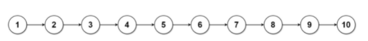

```java
Input: head = [1,2,3,4,5,6,7,8,9,10], k = 3
Output: [[1,2,3,4],[5,6,7],[8,9,10]]
Explanation:
The input has been split into consecutive parts with size difference at most 1, and earlier parts are a larger size than the later parts.
```

**Constraints:**
```java
The number of nodes in the list is in the range [0, 1000].
0 <= Node.val <= 1000
1 <= k <= 50
```


[к оглавлению](#Tasks-from-leetcode)

## Leetcode Lesson 23

Keyboard Row (Easy)
-
Given an array of strings `words`, return the words that can be typed using letters of the alphabet on only one row of American keyboard like the image below.

In the **American keyboard**:

- the first row consists of the characters `"qwertyuiop"`,
- the second row consists of the characters `"asdfghjkl"`, and
- the third row consists of the characters `"zxcvbnm"`.

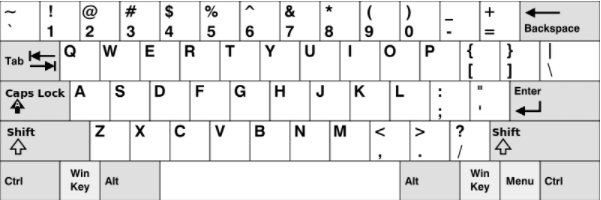</br>

**Example 1:**
```java
Input: words = ["Hello","Alaska","Dad","Peace"]
Output: ["Alaska","Dad"]
```

**Example 2:**
```java
Input: words = ["omk"]
Output: []
```

**Example 3:**
```java
Input: words = ["adsdf","sfd"]
Output: ["adsdf","sfd"]
```

**Constraints:**
```java
1 <= words.length <= 20
1 <= words[i].length <= 100
words[i] consists of English letters (both lowercase and uppercase).
```

[к оглавлению](#Tasks-from-leetcode)


## Leetcode Lesson 24

Fizz Buzz (Easy)
-
Given an integer n, return a string array answer (1-indexed) where:

- answer[i] == "FizzBuzz" if i is divisible by 3 and 5.
- answer[i] == "Fizz" if i is divisible by 3.
- answer[i] == "Buzz" if i is divisible by 5.
- answer[i] == i if non of the above conditions are true.

**Example 1:**
```java
Input: n = 3
Output: ["1","2","Fizz"]
```

**Example 2:**
```java
Input: n = 5
Output: ["1","2","Fizz","4","Buzz"]
```

**Example 3:**
```java
Input: n = 15
Output: ["1","2","Fizz","4","Buzz","Fizz","7","8","Fizz","Buzz","11","Fizz","13","14","FizzBuzz"]
```

**Constraints:**
```java
1 <= n <= 104
```

[к оглавлению](#Tasks-from-leetcode)

## Leetcode Lesson 25

Day of the Week (Easy)
-
Given a date, return the corresponding day of the week for that date.
The input is given as three integers representing the day, month and year respectively.
Return the answer as one of the following values {"Sunday", "Monday", "Tuesday", "Wednesday", "Thursday", "Friday", "Saturday"}.

**Example 1:**
```java
Input: day = 31, month = 8, year = 2019
Output: "Saturday"
```

**Example 2:**
```java
Input: day = 18, month = 7, year = 1999
Output: "Sunday"
```

**Example 3:**
```java
Input: day = 15, month = 8, year = 1993
Output: "Sunday"
```

**Constraints:**
```java
The given dates are valid dates between the years 1971 and 2100.
```

[к оглавлению](#Tasks-from-leetcode)


## Leetcode Lesson 26

Check If N and Its Double Exist (Easy)
-
Given an array arr of integers, check if there exists two integers N and M such that N is the double of M ( i.e. N = 2 * M).
More formally check if there exists two indices i and j such that :
```java
i != j
0 <= i, j < arr.length
arr[i] == 2 * arr[j]
```

**Example 1:**
```java
Input: arr = [10,2,5,3]
Output: true
Explanation: N = 10 is the double of M = 5,that is, 10 = 2 * 5.
```

**Example 2:**
```java
Input: arr = [7,1,14,11]
Output: true
Explanation: N = 14 is the double of M = 7,that is, 14 = 2 * 7.
```

**Example 3:**
```java
Input: arr = [3,1,7,11]
Output: false
Explanation: In this case does not exist N and M, such that N = 2 * M.
```

**Constraints:**
```java
2 <= arr.length <= 500
-10^3 <= arr[i] <= 10^3
```

[к оглавлению](#Tasks-from-leetcode)


## Leetcode Lesson 27

Roman to Integer (Easy)
-
Roman numerals are represented by seven different symbols: I, V, X, L, C, D and M.
```
Symbol       Value
I             1
V             5
X             10
L             50
C             100
D             500
M             1000
```
For example, 2 is written as II in Roman numeral, just two one's added together. 12 is written as XII, which is simply 
X + II. The number 27 is written as XXVII, which is XX + V + II. Roman numerals are usually written largest to smallest 
from left to right. However, the numeral for four is not IIII. Instead, the number four is written as IV. Because 
the one is before the five we subtract it making four. The same principle applies to the number nine, which is written 
as IX. There are six instances where subtraction is used:

- `I` can be placed before `V` (5) and `X` (10) to make 4 and 9.
- `X` can be placed before `L` (50) and `C` (100) to make 40 and 90.
- `C` can be placed before `D` (500) and `M` (1000) to make 400 and 900.
Given a roman numeral, convert it to an integer.

  
**Example 1:**
```java
Input: s = "III"
Output: 3
```

**Example 2:**
```java
Input: s = "IV"
Output: 4
```

**Example 3:**
```java
Input: s = "IX"
Output: 9
```

**Example 4:**
```java
Input: s = "LVIII"
Output: 58
Explanation: L = 50, V= 5, III = 3.
```

**Example 5:**
```java
Input: s = "MCMXCIV"
Output: 1994
Explanation: M = 1000, CM = 900, XC = 90 and IV = 4.
```

**Constraints:**
```java
1 <= s.length <= 15
s contains only the characters ('I', 'V', 'X', 'L', 'C', 'D', 'M').
It is guaranteed that s is a valid roman numeral in the range [1, 3999].
```

[к оглавлению](#Tasks-from-leetcode)


## Leetcode Lesson 28

Merge Two Sorted Lists (Easy)
-
Merge two sorted linked lists and return it as a **sorted** list. The list should be made by splicing together the nodes of the first two lists.

**Example 1:**</br>
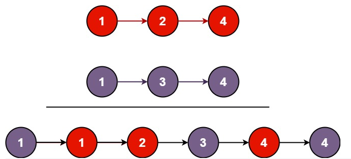

```java
Input: l1 = [1,2,4], l2 = [1,3,4]
Output: [1,1,2,3,4,4]
```

**Example 2:**
```java
Input: l1 = [], l2 = []
Output: []
```

**Example 3:**
```java
Input: l1 = [], l2 = [0]
Output: [0]
```

**Constraints:**
```java
The number of nodes in both lists is in the range [0, 50].
-100 <= Node.val <= 100
Both l1 and l2 are sorted in non-decreasing order.
```

[к оглавлению](#Tasks-from-leetcode)


## Leetcode Lesson 29

Remove Duplicates from Sorted Array (Easy)
-
Given an integer array `nums` sorted in **non-decreasing order**, remove the duplicates in-place such that each unique 
element appears only once. The relative order of the elements should be kept the same. Since it is impossible to change 
the length of the array in some languages, you must instead have the result be placed in the first part of the array 
nums. More formally, if there are k elements after removing the duplicates, then the first k elements of nums should 
hold the final result. It does not matter what you leave beyond the first k elements. Return k after placing the final 
result in the first k slots of nums. Do not allocate extra space for another array. You must do this by modifying the 
input array in-place with O(1) extra memory.

Custom Judge:

The judge will test your solution with the following code:
```java
int[] nums = [...]; // Input array
int[] expectedNums = [...]; // The expected answer with correct length

int k = removeDuplicates(nums); // Calls your implementation

assert k == expectedNums.length;
for (int i = 0; i < k; i++) {
assert nums[i] == expectedNums[i];
}
```

If all assertions pass, then your solution will be accepted.

**Example 1:**
```java
Input: nums = [1,1,2]
Output: 2, nums = [1,2,_]
Explanation: Your function should return k = 2, with the first two elements of nums being 1 and 2 respectively.
It does not matter what you leave beyond the returned k (hence they are underscores).
```

**Example 2:**
```java
Input: nums = [0,0,1,1,1,2,2,3,3,4]
Output: 5, nums = [0,1,2,3,4,_,_,_,_,_]
Explanation: Your function should return k = 5, with the first five elements of nums being 0, 1, 2, 3, and 4 respectively.
It does not matter what you leave beyond the returned k (hence they are underscores).
```

**Constraints:**
```java
0 <= nums.length <= 3 * 104
-100 <= nums[i] <= 100
nums is sorted in non-decreasing order.
```

[к оглавлению](#Tasks-from-leetcode)


## Leetcode Lesson 30

Implement strStr() (Easy)
-
Implement strStr().

Return the index of the first occurrence of needle in haystack, or -1 if needle is not part of haystack.

**Clarification:**

What should we return when needle is an empty string? This is a great question to ask during an interview.
For the purpose of this problem, we will return 0 when needle is an empty string. This is consistent to C's strstr() and Java's indexOf().

**Example 1:**
```java
Input: haystack = "hello", needle = "ll"
Output: 2
```

**Example 2:**
```java
Input: haystack = "aaaaa", needle = "bba"
Output: -1
```

**Example 3:**
```java
Input: haystack = "", needle = ""
Output: 0
```

**Constraints:**
```java
0 <= haystack.length, needle.length <= 5 * 104
haystack and needle consist of only lower-case English characters.
```


[к оглавлению](#Tasks-from-leetcode)

## Leetcode Lesson 31

Maximum Subarray (Easy)
-
Given an integer array `nums`, find the contiguous subarray (containing at least one number) which has the largest sum 
and return its sum.</br>
A **subarray** is a **contiguous** part of an array.

**Example 1:**
```java
Input: nums = [-2,1,-3,4,-1,2,1,-5,4]
Output: 6
Explanation: [4,-1,2,1] has the largest sum = 6.
```

**Example 2:**
```java
Input: nums = [1]
Output: 1
```

**Example 3:**
```java
Input: nums = [5,4,-1,7,8]
Output: 23
```

**Constraints:**
```java
1 <= nums.length <= 105
-104 <= nums[i] <= 104
```

**Follow up:** If you have figured out the `O(n)` solution, try coding another solution using the **divide and conquer** 
approach, which is more subtle.

[к оглавлению](#Tasks-from-leetcode)


## Leetcode Lesson 32

Sqrt(x) (Easy)
-

Given a non-negative integer `x`, compute and return the square root of `x`.</br>
Since the return type is an integer, the decimal digits are **truncated**, and only **the integer part** of the result 
is returned.</br>
**Note:** You are not allowed to use any built-in exponent function or operator, such as `pow(x, 0.5)` or `x ** 0.5`.

**Example 1:**
```java
Input: x = 4
Output: 2
```

**Example 2:**
```java
Input: x = 8
Output: 2
Explanation: The square root of 8 is 2.82842..., and since the decimal part is truncated, 2 is returned.
```

**Constraints:**
```java
0 <= x <= 231 - 1
```

[к оглавлению](#Tasks-from-leetcode)


## Leetcode Lesson 33

Climbing Stairs (Easy)
-
You are climbing a staircase. It takes `n` steps to reach the top.
Each time you can either climb `1` or `2` steps. In how many distinct ways can you climb to the top?

**Example 1:**
```java
Input: n = 2
Output: 2
Explanation: There are two ways to climb to the top.
1. 1 step + 1 step
2. 2 steps
```

**Example 2:**
```java
Input: n = 3
Output: 3
Explanation: There are three ways to climb to the top.
1. 1 step + 1 step + 1 step
2. 1 step + 2 steps
3. 2 steps + 1 step
```

**Constraints:**
```java
1 <= n <= 45
```

[к оглавлению](#Tasks-from-leetcode)


## Leetcode Lesson 34

Merge Sorted Array (Easy)
-
You are given two integer arrays nums1 and nums2, sorted in non-decreasing order, and two integers m and n,
representing the number of elements in nums1 and nums2 respectively.
Merge nums1 and nums2 into a single array sorted in non-decreasing order.
The final sorted array should not be returned by the function, but instead be stored inside the array nums1. 
To accommodate this, nums1 has a length of m + n, where the first m elements denote the elements that should be merged,
and the last n elements are set to 0 and should be ignored. nums2 has a length of n.

**Example 1:**
```java
Input: nums1 = [1,2,3,0,0,0], m = 3, nums2 = [2,5,6], n = 3
Output: [1,2,2,3,5,6]
Explanation: The arrays we are merging are [1,2,3] and [2,5,6].
The result of the merge is [1,2,2,3,5,6] with the underlined elements coming from nums1.
```

**Example 2:**
```java
Input: nums1 = [1], m = 1, nums2 = [], n = 0
Output: [1]
Explanation: The arrays we are merging are [1] and [].
The result of the merge is [1].
```

**Example 3:**
```java
Input: nums1 = [0], m = 0, nums2 = [1], n = 1
Output: [1]
Explanation: The arrays we are merging are [] and [1].
The result of the merge is [1].
Note that because m = 0, there are no elements in nums1. The 0 is only there to ensure the merge result can fit in nums1.
```

**Constraints:**
```java
nums1.length == m + n
nums2.length == n
0 <= m, n <= 200
1 <= m + n <= 200
-109 <= nums1[i], nums2[j] <= 109
```

**Follow up:** Can you come up with an algorithm that runs in O(m + n) time?

[к оглавлению](#Tasks-from-leetcode)


## Leetcode Lesson 35

Binary Tree Inorder Traversal (Easy)
-
Given the `root` of a binary tree, return the inorder traversal of its nodes' values.

**Example 1:**</br>
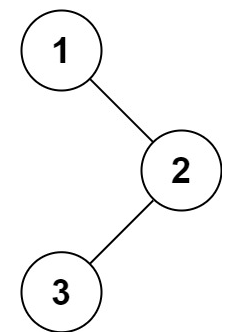
```java
Input: root = [1,null,2,3]
Output: [1,3,2]
```

**Example 2:**
```java
Input: root = []
Output: []
```

**Example 3:**
```java
Input: root = [1]
Output: [1]
```

**Example 4:**</br>
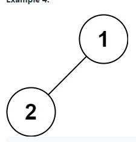
```java
Input: root = [1,2]
Output: [2,1]
```

**Example 5:**</br>
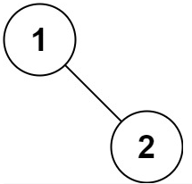
```java
Input: root = [1,null,2]
Output: [1,2]
```

**Constraints:**
```java
The number of nodes in the tree is in the range [0, 100].
-100 <= Node.val <= 100
```

**Follow up:** 
Recursive solution is trivial, could you do it iteratively?

[к оглавлению](#Tasks-from-leetcode)


## Leetcode Lesson 36

Pascal's Triangle (Easy)
-
Given an integer numRows, return the first numRows of Pascal's triangle.
In Pascal's triangle, each number is the sum of the two numbers directly above it as shown:

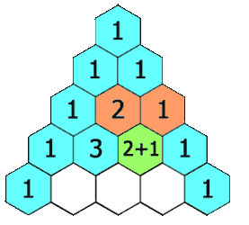

**Example 1:**
```java
Input: numRows = 5
Output: [[1],[1,1],[1,2,1],[1,3,3,1],[1,4,6,4,1]]
```
**Example 2:**
```java
Input: numRows = 1
Output: [[1]]
```

**Constraints:**
```java
1 <= numRows <= 30
```

[к оглавлению](#Tasks-from-leetcode)


## Leetcode Lesson 37

Delete Node in a Linked List (Easy)
-
Write a function to delete a node in a singly-linked list. You will not be given access to the head of the list, 
instead you will be given access to the node to be deleted directly.
It is guaranteed that the node to be deleted is not a tail node in the list.

**Example 1:**</br>
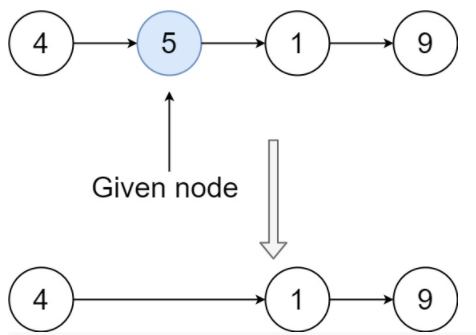
```java
Input: head = [4,5,1,9], node = 5
Output: [4,1,9]
Explanation: You are given the second node with value 5, 
the linked list should become 4 -> 1 -> 9 after calling your function.
```

**Example 2:**</br>
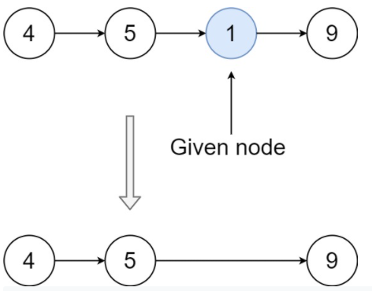
```java
Input: head = [4,5,1,9], node = 1
Output: [4,5,9]
Explanation: You are given the third node with value 1, the linked list should become 4 -> 5 -> 9 after calling your function.
```

**Example 3:**
```java
Input: head = [1,2,3,4], node = 3
Output: [1,2,4]
```

**Example 4:**
```java
Input: head = [0,1], node = 0
Output: [1]
```

**Example 5:**
```java
Input: head = [-3,5,-99], node = -3
Output: [5,-99]
```

**Constraints:**
```java
The number of the nodes in the given list is in the range [2, 1000].
-1000 <= Node.val <= 1000
The value of each node in the list is unique.
The node to be deleted is in the list and is not a tail node
```

[к оглавлению](#Tasks-from-leetcode)


## Leetcode Lesson 38

Best Time to Buy and Sell Stock (Easy)
-
You are given an array prices where prices[i] is the price of a given stock on the ith day.
You want to maximize your profit by choosing a single day to buy one stock and choosing a different day in
the future to sell that stock. Return the maximum profit you can achieve from this transaction. 
If you cannot achieve any profit, return 0

**Example 1:**
```java
Input: prices = [7,1,5,3,6,4]
Output: 5
Explanation: Buy on day 2 (price = 1) and sell on day 5 (price = 6), profit = 6-1 = 5.
Note that buying on day 2 and selling on day 1 is not allowed because you must buy before you sell.
```

**Example 2:**
```java
Input: prices = [7,6,4,3,1]
Output: 0
Explanation: In this case, no transactions are done and the max profit = 0.
```

**Constraints:**
```java
1 <= prices.length <= 105
0 <= prices[i] <= 104
```

[к оглавлению](#Tasks-from-leetcode)


## Leetcode Lesson 39

Valid Palindrome (Easy)
-
A phrase is a palindrome if, after converting all uppercase letters into lowercase letters 
and removing all non-alphanumeric characters, it reads the same forward and backward. 
Alphanumeric characters include letters and numbers.
Given a string s, return true if it is a palindrome, or false otherwise.

**Example 1:**
```java
Input: s = "A man, a plan, a canal: Panama"
Output: true
Explanation: "amanaplanacanalpanama" is a palindrome.
```

**Example 2:**
```java
Input: s = "race a car"
Output: false
Explanation: "raceacar" is not a palindrome.
```

**Example 3:**
```java
Input: s = " "
Output: true
Explanation: s is an empty string "" after removing non-alphanumeric characters.
Since an empty string reads the same forward and backward, it is a palindrome.
```

**Constraints:**
```java
1 <= s.length <= 2 * 105
s consists only of printable ASCII characters.
```

[к оглавлению](#Tasks-from-leetcode)


## Leetcode Lesson 40

Missing Number (Easy)
-

Given an array nums containing n distinct numbers in the range [0, n], return the only number in the range that is missing from the array.

**Example 1:**
```java
Input: nums = [3,0,1]
Output: 2
Explanation: n = 3 since there are 3 numbers, so all numbers are in the range [0,3]. 2 is the missing number in the range since it does not appear in nums.
```

**Example 2:**
```java
Input: nums = [0,1]
Output: 2
Explanation: n = 2 since there are 2 numbers, so all numbers are in the range [0,2]. 2 is the missing number in the range since it does not appear in nums.
```

**Example 3:**
```java
Input: nums = [9,6,4,2,3,5,7,0,1]
Output: 8
Explanation: n = 9 since there are 9 numbers, so all numbers are in the range [0,9]. 8 is the missing number in the range since it does not appear in nums.
```

**Example 4:**
```java
Input: nums = [0]
Output: 1
Explanation: n = 1 since there is 1 number, so all numbers are in the range [0,1]. 1 is the missing number in the range since it does not appear in nums.
```


**Constraints:**
```java
n == nums.length
1 <= n <= 104
0 <= nums[i] <= n
All the numbers of nums are unique.
```

**Follow up:** 
Could you implement a solution using only O(1) extra space complexity and O(n) runtime complexity?

[к оглавлению](#Tasks-from-leetcode)


## Leetcode Lesson 41

Min Stack
-
Design a stack that supports push, pop, top, and retrieving the minimum element in constant time.
Implement the `MinStack` class:

- `MinStack()` initializes the stack object.
- `void push(int val)` pushes the element val onto the stack.
- `void pop()` removes the element on the top of the stack.
- `int top()` gets the top element of the stack.
- `int getMin()` retrieves the minimum element in the stack.

**Example 1:**
```java
Input
["MinStack","push","push","push","getMin","pop","top","getMin"]
[[],[-2],[0],[-3],[],[],[],[]]

Output
[null,null,null,null,-3,null,0,-2]

Explanation
MinStack minStack = new MinStack();
minStack.push(-2);
minStack.push(0);
minStack.push(-3);
minStack.getMin(); // return -3
minStack.pop();
minStack.top();    // return 0
minStack.getMin(); // return -2
```

**Constraints:**
```java
-231 <= val <= 231 - 1
Methods pop, top and getMin operations will always be called on non-empty stacks.
At most 3 * 104 calls will be made to push, pop, top, and getMin.
```

[к оглавлению](#Tasks-from-leetcode)


## Leetcode Lesson 42

Excel Sheet Column Number
-
Given a string `columnTitle` that represents the column title as appear in an Excel sheet, 
return its corresponding column number.

**For example:**
```java
A -> 1
B -> 2
C -> 3
...
Z -> 26
AA -> 27
AB -> 28
...
```

**Example 1:**
```java
Input: columnTitle = "A"
Output: 1
```
**Example 2:**
```java
Input: columnTitle = "AB"
Output: 28
```
**Example 3:**
```java
Input: columnTitle = "ZY"
Output: 701
```
**Example 4:**
```java
Input: columnTitle = "FXSHRXW"
Output: 2147483647
```

**Constraints:**
```java
1 <= columnTitle.length <= 7
columnTitle consists only of uppercase English letters.
columnTitle is in the range ["A", "FXSHRXW"].
```

[к оглавлению](#Tasks-from-leetcode)


## Leetcode Lesson 43

Move Zeroes
-
Given an integer array `nums`, move all `0's` to the end of it while maintaining the relative order of the non-zero elements.

**Note** that you must do this in-place without making a copy of the array.

**Example 1:**
```java
Input: nums = [0,1,0,3,12]
Output: [1,3,12,0,0]
```
**Example 2:**
```java
Input: nums = [0]
Output: [0]
```

**Constraints:**
```java
1 <= nums.length <= 104
-231 <= nums[i] <= 231 - 1
```

**Follow up:** Could you minimize the total number of operations done?

[к оглавлению](#Tasks-from-leetcode)


## Leetcode Lesson 44

First Unique Character in a String
-
Given a string `s`, find the first non-repeating character in it and return its index. If it does not exist, return `-1`.

**Example 1:**
```java
Input: s = "leetcode"
Output: 0
```
**Example 2:**
```java
Input: s = "loveleetcode"
Output: 2
```
**Example 3:**
```java
Input: s = "aabb"
Output: -1
```

**Constraints:**
```java
1 <= s.length <= 105
s consists of only lowercase English letters.
```

[к оглавлению](#Tasks-from-leetcode)


## Leetcode Lesson 45

Happy Number
-
Write an algorithm to determine if a number n is happy.

A **happy number** is a number defined by the following process:

- Starting with any positive integer, replace the number by the sum of the squares of its digits.
- Repeat the process until the number equals 1 (where it will stay), or it **loops endlessly in a cycle** which does not include 1.
- Those numbers for which this process ends in 1 are happy. 

Return `true` if `n` is a happy number, and `false` if not.

**Example 1:**
```java
Input: n = 19
Output: true
Explanation:
12 + 92 = 82
82 + 22 = 68
62 + 82 = 100
12 + 02 + 02 = 1
```

**Example 2:**
```java
Input: n = 2
Output: false
```

**Constraints:**
```java
1 <= n <= 231 - 1
```

[к оглавлению](#Tasks-from-leetcode)


## Leetcode Lesson 46

Intersection of Two Arrays II
-

Given two integer arrays nums1 and nums2, return an array of their intersection. 
Each element in the result must appear as many times as it shows in both arrays 
and you may return the result in any order.

**Example 1:**
```java
Input: nums1 = [1,2,2,1], nums2 = [2,2]
Output: [2,2]
```
**Example 2:**
```java
Input: nums1 = [4,9,5], nums2 = [9,4,9,8,4]
Output: [4,9]
Explanation: [9,4] is also accepted.
```

**Constraints:**
```java
1 <= nums1.length, nums2.length <= 1000
0 <= nums1[i], nums2[i] <= 1000
```

**Follow up:**
```java
What if the given array is already sorted? How would you optimize your algorithm?
What if nums1's size is small compared to nums2's size? Which algorithm is better?
What if elements of nums2 are stored on disk, and the memory is limited such that you cannot load all elements into the memory at once?
```

[к оглавлению](#Tasks-from-leetcode)


## Leetcode Lesson 47

Reverse Bits
-
Reverse bits of `a` given 32 bits unsigned integer.

**Note:**
```
    Note that in some languages, such as Java, there is no unsigned integer type. In this case, both input and output will be given as a signed integer type. They should not affect your implementation, as the integer's internal binary representation is the same, whether it is signed or unsigned.
    In Java, the compiler represents the signed integers using 2's complement notation. Therefore, in Example 2 above, the input represents the signed integer -3 and the output represents the signed integer -1073741825.
```

**Example 1:**
```java
Input: n = 00000010100101000001111010011100
Output:    964176192 (00111001011110000010100101000000)
Explanation: The input binary string 00000010100101000001111010011100 represents the unsigned integer 43261596, so return 964176192 which its binary representation is 00111001011110000010100101000000.
```

**Example 2:**
```java
Input: n = 11111111111111111111111111111101
Output:   3221225471 (10111111111111111111111111111111)
Explanation: The input binary string 11111111111111111111111111111101 represents the unsigned integer 4294967293, so return 3221225471 which its binary representation is 10111111111111111111111111111111.
```

**Constraints:**
```
    The input must be a binary string of length 32
```
Follow up: If this function is called many times, how would you optimize it?

[к оглавлению](#Tasks-from-leetcode)


## Leetcode Lesson 48

Contains Duplicate II
-
Given an integer array `nums` and an integer `k`, return `true` if there are two distinct indices i and j 
in the array such that nums[i] == nums[j] and abs(i - j) <= k.

**Example 1:**
```
Input: nums = [1,2,3,1], k = 3
Output: true
```
**Example 2:**
```
Input: nums = [1,0,1,1], k = 1
Output: true
```
**Example 3:**
```
Input: nums = [1,2,3,1,2,3], k = 2
Output: false
```

**Constraints:**
```
    1 <= nums.length <= 105
    -109 <= nums[i] <= 109
    0 <= k <= 105
```

[к оглавлению](#Tasks-from-leetcode)

## Leetcode Lesson 49

Island Perimeter
-
You are given row x col grid representing a map where grid[i][j] = 1 represents land and grid[i][j] = 0 represents water.
Grid cells are connected horizontally/vertically (not diagonally). The grid is completely surrounded by water, 
and there is exactly one island (i.e., one or more connected land cells).
The island doesn't have "lakes", meaning the water inside isn't connected to the water around the island. 
One cell is a square with side length 1. The grid is rectangular, width and height don't exceed 100. 
Determine the perimeter of the island.

**Example 1:**</br>
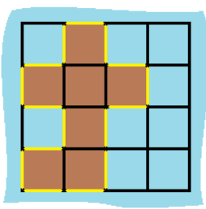
```
Input: grid = [[0,1,0,0],[1,1,1,0],[0,1,0,0],[1,1,0,0]]
Output: 16
Explanation: The perimeter is the 16 yellow stripes in the image above.
```
**Example 2:**
```
Input: grid = [[1]]
Output: 4
```

**Example 3:**
```
Input: grid = [[1,0]]
Output: 4
```

**Constraints:**
```
    row == grid.length
    col == grid[i].length
    1 <= row, col <= 100
    grid[i][j] is 0 or 1.
    There is exactly one island in grid.
```

[к оглавлению](#Tasks-from-leetcode)


## Leetcode Lesson 50

Valid Anagram
-
Given two strings `s` and `t`, return `true` if `t` is an anagram of `s`, and `false` otherwise.

An Anagram is a word or phrase formed by rearranging the letters of a different word or phrase, 
typically using all the original letters exactly once.

**Example 1:**
```
Input: s = "anagram", t = "nagaram"
Output: true
```

**Example 2:**
```
Input: s = "rat", t = "car"
Output: false
```


**Constraints:**
```
    1 <= s.length, t.length <= 5 * 104
    s and t consist of lowercase English letters.
```


Follow up: What if the inputs contain Unicode characters? How would you adapt your solution to such a case.

[к оглавлению](#Tasks-from-leetcode)


## Leetcode Lesson 51

1114 Print in Order
-
Suppose we have a class:
```java
    public class Foo {
      public void first() { print("first"); }
      public void second() { print("second"); }
      public void third() { print("third"); }
    }
```
The same instance of `Foo` will be passed to three different threads. Thread A will call `first()`, thread B will call 
`second()`, and thread C will call `third()`. Design a mechanism and modify the program to ensure that `second()` is 
executed after `first()`, and `third()` is executed after `second()`.

**Note:**

We do not know how the threads will be scheduled in the operating system, even though the numbers in the input seem to 
imply the ordering. The input format you see is mainly to ensure our tests' comprehensiveness.

**Example 1:**
```
Input: nums = [1,2,3]
        Output: "firstsecondthird"
        Explanation: There are three threads being fired asynchronously. The input [1,2,3] means thread A calls first(), 
        thread B calls second(), and thread C calls third(). "firstsecondthird" is the correct output.
```
**Example 2:**
```
Input: nums = [1,3,2]
Output: "firstsecondthird"
Explanation: The input [1,3,2] means thread A calls first(), thread B calls third(), and thread C calls second(). 
"firstsecondthird" is the correct output.
```

**Constraints:**
- `nums` is a permutation of `[1, 2, 3]`.


[к оглавлению](#Tasks-from-leetcode)


## Leetcode Lesson 52

1768 Merge Strings Alternately
-

You are given two strings `word1` and `word2`. Merge the strings by adding letters in alternating order, 
starting with word1. If a string is longer than the other, append the additional letters onto the end of the merged string.
Return the merged string.

**Example 1:**
```java
Input: word1 = "abc", word2 = "pqr"
Output: "apbqcr"
Explanation: The merged string will be merged as so:
word1:  a   b   c
word2:    p   q   r
merged: a p b q c r
```

**Example 2:**
```java
Input: word1 = "ab", word2 = "pqrs"
Output: "apbqrs"
Explanation: Notice that as word2 is longer, "rs" is appended to the end.
word1:  a   b 
word2:    p   q   r   s
merged: a p b q   r   s
```

**Example 3:**
```java
Input: word1 = "abcd", word2 = "pq"
Output: "apbqcd"
Explanation: Notice that as word1 is longer, "cd" is appended to the end.
word1:  a   b   c   d
word2:    p   q 
merged: a p b q c   d
```


**Constraints:**

    1 <= word1.length, word2.length <= 100
    word1 and word2 consist of lowercase English letters.


[к оглавлению](#Tasks-from-leetcode)


## Leetcode Lesson 53

2405 Optimal Partition of String
-
Given a string `s`, partition the string into one or more substrings such that the characters in each substring are 
unique. That is, no letter appears in a single substring more than once.
Return the minimum number of substrings in such a partition.
Note that each character should belong to exactly one substring in a partition.

**Example 1:**
```java


Input: s = "abacaba"
Output: 4
Explanation:
Two possible partitions are ("a","ba","cab","a") and ("ab","a","ca","ba").
It can be shown that 4 is the minimum number of substrings needed.
```

**Example 2:**
```java
Input: s = "ssssss"
Output: 6
Explanation:
The only valid partition is ("s","s","s","s","s","s").
```

**onstraints:**

    1 <= s.length <= 105
    s consists of only English lowercase letters.


[к оглавлению](#Tasks-from-leetcode)


## Leetcode Lesson 54

35 Search Insert Position
-
Given a sorted array of distinct integers and a target value, return the index if the target is found. If not, 
return the index where it would be if it were inserted in order.

You must write an algorithm with `O(log n)` runtime complexity.

Example 1:
```java
    Input: nums = [1,3,5,6], target = 5
    Output: 2
```
Example 2:
```java
    Input: nums = [1,3,5,6], target = 2
    Output: 1
```
Example 3:
```java
    Input: nums = [1,3,5,6], target = 7
    Output: 4
```

Constraints:
```
    1 <= nums.length <= 104
    -104 <= nums[i] <= 104
    nums contains distinct values sorted in ascending order.
    -104 <= target <= 104
```

[к оглавлению](#Tasks-from-leetcode)


## Leetcode Lesson 55

22 Generate Parentheses
-
Given `n` pairs of parentheses, write a function to generate all combinations of well-formed parentheses.

**Example 1:**

```java
Input: n = 3
Output: ["((()))","(()())","(())()","()(())","()()()"]
```
**Example 2:**

```java
Input: n = 1
Output: ["()"]
```

**Constraints:**
```
    1 <= n <= 8
```

[к оглавлению](#Tasks-from-leetcode)


## Leetcode Lesson 56

258 Add Digits
-
Given an integer `num`, repeatedly add all its digits until the result has only one digit, and return it.

**Example 1:**
```java
Input: num = 38
Output: 2
Explanation: The process is
38 --> 3 + 8 --> 11
11 --> 1 + 1 --> 2
Since 2 has only one digit, return it.
```

**Example 2:**
```java
Input: num = 0
Output: 0

```


[к оглавлению](#Tasks-from-leetcode)


## Leetcode Lesson 57

111 Minimum Depth of Binary Tree
-
Given a binary tree, find its minimum depth.
The minimum depth is the number of nodes along the shortest path from the root node down to the nearest leaf node.
*Note:* A leaf is a node with no children.

**Example 1:**

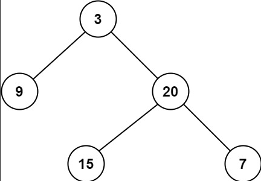

```java
Input: root = [3,9,20,null,null,15,7]
Output: 2
```

**Example 2:**
```java
Input: root = [2,null,3,null,4,null,5,null,6]
Output: 5
```

**Constraints:**
```

    The number of nodes in the tree is in the range [0, 105].
    -1000 <= Node.val <= 1000

```

[к оглавлению](#Tasks-from-leetcode)


## Leetcode Lesson 58

2 Add Two Numbers (Medium)
-
You are given two **non-empty** linked lists representing two non-negative integers. The digits are stored in 
**reverse order**, and each of their nodes contains a single digit. Add the two numbers and return the sum as 
a linked list.

You may assume the two numbers do not contain any leading zero, except the number 0 itself.


```java
Input: l1 = [2,4,3], l2 = [5,6,4]
Output: [7,0,8]
Explanation: 342 + 465 = 807.
```

**Example 2:**
```java
Input: l1 = [0], l2 = [0]
Output: [0]
```

**Example 3:**
```java
Input: l1 = [9,9,9,9,9,9,9], l2 = [9,9,9,9]
Output: [8,9,9,9,0,0,0,1]
```

**Constraints:**
```
    The number of nodes in each linked list is in the range [1, 100].
    0 <= Node.val <= 9
    It is guaranteed that the list represents a number that does not have leading zeros.
```

[к оглавлению](#Tasks-from-leetcode)

## Leetcode Lesson 59

230 Kth Smallest Element in a BST
-

Given the `root` of a binary search tree, and an integer `k`, return the `k th` smallest value (1-indexed) of all the 
values of the nodes in the tree.

**Example 1:**</br>
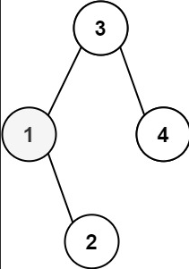
```java
Input: root = [3,1,4,null,2], k = 1
Output: 1
```

**Example 2:**</br>
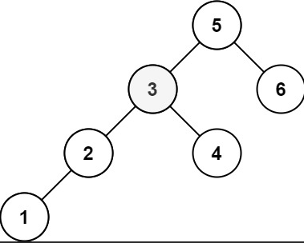
```java
Input: root = [5,3,6,2,4,null,null,1], k = 3
Output: 3
```

Constraints:
```
    The number of nodes in the tree is n.
    1 <= k <= n <= 104
    0 <= Node.val <= 104
```

[к оглавлению](#Tasks-from-leetcode)


## Leetcode Lesson 60

797 All Paths From Source to Target
-
Given a directed acyclic graph (`DAG`) of `n` nodes labeled from `0` to `n - 1`, find all possible paths from node `0` 
to node `n - 1` and return them in any order.

The graph is given as follows: `graph[i]` is a list of all nodes you can visit from node `i` 
(i.e., there is a directed edge from node `i` to node `graph[i][j]`).

**Example 1:**</br>
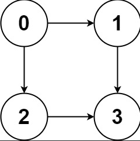
```java
Input: graph = [[1,2],[3],[3],[]]
Output: [[0,1,3],[0,2,3]]
Explanation: There are two paths: 0 -> 1 -> 3 and 0 -> 2 ->
```

**Example 2:**</br>
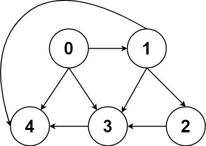
```java
Input: graph = [[4,3,1],[3,2,4],[3],[4],[]]
Output: [[0,4],[0,3,4],[0,1,3,4],[0,1,2,3,4],[0,1,4]]
```

**Constraints:**
```
    n == graph.length
    2 <= n <= 15
    0 <= graph[i][j] < n
    graph[i][j] != i (i.e., there will be no self-loops).
    All the elements of graph[i] are unique.
    The input graph is guaranteed to be a DAG.
```

[к оглавлению](#Tasks-from-leetcode)


## Leetcode Lesson 61

75 Sort Colors
-
Given an array `nums` with `n` objects colored red, white, or blue, sort them `in-place` so that objects of the same color 
are adjacent, with the colors in the order red, white, and blue.
We will use the integers `0`, `1`, and `2` to represent the color red, white, and blue, respectively.
You must solve this problem without using the library's sort function.

**Example 1:**
```java
Input: nums = [2,0,2,1,1,0]
Output: [0,0,1,1,2,2]
```

**Example 2:**
```java
Input: nums = [2,0,1]
Output: [0,1,2]
```

**Constraints:**
```
    n == nums.length
    1 <= n <= 300
    nums[i] is either 0, 1, or 2.
```


Follow up: Could you come up with a one-pass algorithm using only constant extra space?

[к оглавлению](#Tasks-from-leetcode)


## Leetcode Lesson 62

5 Longest Palindromic Substring
-
Given a string `s`, return the longest palindromic substring in `s`.

**Example 1:**
```java
Input: s = "babad"
Output: "bab"
Explanation: "aba" is also a valid answer.
```
**Example 2:**
```java
Input: s = "cbbd"
Output: "bb"
```


Constraints:
```
    1 <= s.length <= 1000
    s consist of only digits and English letters.
```

[к оглавлению](#Tasks-from-leetcode)


## Leetcode Lesson 63

67 Add Binary
-
Given two binary strings `a` and `b`, return their sum as a binary string.

**Example 1:**
```
    Input: a = "11", b = "1"
    Output: "100"
```

**Example 2:**
```
    Input: a = "1010", b = "1011"
    Output: "10101"
```

**Constraints:**
```
    1 <= a.length, b.length <= 104
    a and b consist only of '0' or '1' characters.
    Each string does not contain leading zeros except for the zero itself.
```

[к оглавлению](#Tasks-from-leetcode)


## Leetcode Lesson 64

3 Longest Substring Without Repeating Characters
-
Given a string s, find the length of the longest substring without repeating characters.

**Example 1:**
```
    Input: s = "abcabcbb"
    Output: 3
    Explanation: The answer is "abc", with the length of 3.
```

**Example 2:**
```
    Input: s = "bbbbb"
    Output: 1
    Explanation: The answer is "b", with the length of 1.
```

**Example 3:**
```
    Input: s = "pwwkew"
    Output: 3
    Explanation: The answer is "wke", with the length of 3.
    Notice that the answer must be a substring, "pwke" is a subsequence and not a substring.
```


**Constraints:**
```
    0 <= s.length <= 5 * 104
    s consists of English letters, digits, symbols and spaces.
```

[к оглавлению](#Tasks-from-leetcode)


## Leetcode Lesson 65

100 Same Tree
-
Given the roots of two binary trees `p` and `q`, write a function to check if they are the same or not.
Two binary trees are considered the same if they are structurally identical, and the nodes have the same value.

**Example 1:**</br>
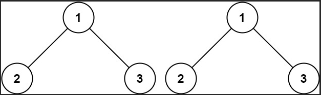
```java
Input: p = [1,2,3], q = [1,2,3]
Output: true
```

**Example 2:**</br>
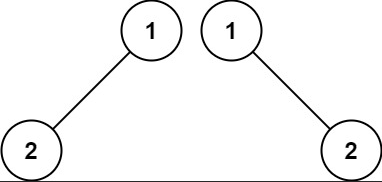
```java
Input: p = [1,2], q = [1,null,2]
Output: false
```

**Example 3:**</br>
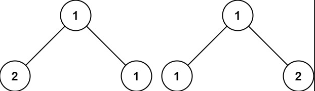
```java
Input: p = [1,2,1], q = [1,1,2]
Output: false
```
**Constraints:**
```
    The number of nodes in both trees is in the range [0, 100].
    -10^4 <= Node.val <= 10^4
```

[к оглавлению](#Tasks-from-leetcode)


## Leetcode Lesson 66

852 Peak Index in a Mountain Array
-
An array `arr` a *mountain* if the following properties hold:
- `arr.length >= 3`
- There exists some `i` with `0 < i < arr.length - 1` such that:
    - `arr[0] < arr[1] < ... < arr[i - 1] < arr[i]`
    - `arr[i] > arr[i + 1] > ... > arr[arr.length - 1]`

Given a mountain array arr, return the index i such that 
`arr[0] < arr[1] < ... < arr[i - 1] < arr[i] > arr[i + 1] > ... > arr[arr.length - 1].`

You must solve it in `O(log(arr.length))` time complexity.

**Example 1:**
```java
Input: arr = [0,1,0]
Output: 1
```

**Example 2:**
```java
Input: arr = [0,2,1,0]
Output: 1
```

**Example 3:**
```java
Input: arr = [0,10,5,2]
Output: 1
```

**Constraints:**
```
    3 <= arr.length <= 105
    0 <= arr[i] <= 106
    arr is guaranteed to be a mountain array.
```

[к оглавлению](#Tasks-from-leetcode)


## Leetcode Lesson 67

263 Ugly Number
-

An *ugly number* is a positive integer whose prime factors are limited to `2`, `3`, and `5`.
Given an integer `n`, return `true` if `n` is an *ugly number*.

**Example 1:**
```
Input: n = 6
Output: true
Explanation: 6 = 2 × 3
```

**Example 2:**
```
Input: n = 1
Output: true
Explanation: 1 has no prime factors, therefore all of its prime factors are limited to 2, 3, and 5.
```

**Example 3:**
```
Input: n = 14
Output: false
Explanation: 14 is not ugly since it includes the prime factor 7.
```

**Constraints:**
```
    -231 <= n <= 231 - 1
```

[к оглавлению](#Tasks-from-leetcode)


## Leetcode Lesson 68

101 Symmetric Tree
-
Given the `root` of a binary tree, check whether it is a mirror of itself (i.e., symmetric around its center).

**Example 1:**</br>
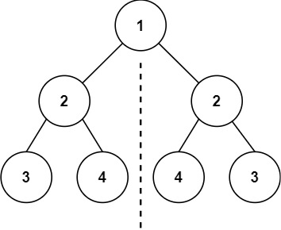
```
Input: root = [1,2,2,3,4,4,3]
Output: true
```

**Example 2:**</br>
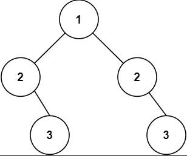
```
Input: root = [1,2,2,null,3,null,3]
Output: false
```

**Constraints:**
```
    The number of nodes in the tree is in the range [1, 1000].
    -100 <= Node.val <= 100
```

[к оглавлению](#Tasks-from-leetcode)


## Leetcode Lesson 69

104 Maximum Depth of Binary Tree
-
Given the `root` of a binary tree, return its maximum depth.
A binary tree's maximum depth is the number of nodes along the longest path from the root node down to 
the farthest leaf node.

**Example 1:**
**Example 1:**</br>
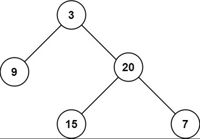
```java
Input: root = [3,9,20,null,null,15,7]
Output: 3
```

**Example 2:**
```java
Input: root = [1,null,2]
Output: 2
```

**Constraints:**
```
    The number of nodes in the tree is in the range [0, 104].
    -100 <= Node.val <= 100
```


[к оглавлению](#Tasks-from-leetcode)


## Leetcode Lesson 70

134 Gas Station
-
There are `n` gas stations along a circular route, where the amount of gas at the `i` station is `gas[i]`.

You have a car with an unlimited gas tank and it costs `cost[i]` of gas to travel from the ith station to its next 
`(i + 1)` station. You begin the journey with an empty tank at one of the gas stations.

Given two integer arrays `gas` and `cost`, return the starting gas station's index if you can travel around the circuit 
once in the clockwise direction, otherwise return `-1`. If there exists a solution, it is **guaranteed** to be **unique**

**Example 1:**
```
Input: gas = [1,2,3,4,5], cost = [3,4,5,1,2]
Output: 3
Explanation:
Start at station 3 (index 3) and fill up with 4 unit of gas. Your tank = 0 + 4 = 4
Travel to station 4. Your tank = 4 - 1 + 5 = 8
Travel to station 0. Your tank = 8 - 2 + 1 = 7
Travel to station 1. Your tank = 7 - 3 + 2 = 6
Travel to station 2. Your tank = 6 - 4 + 3 = 5
Travel to station 3. The cost is 5. Your gas is just enough to travel back to station 3.
Therefore, return 3 as the starting index.
```

**Example 2:**
```
Input: gas = [2,3,4], cost = [3,4,3]
Output: -1
Explanation:
You can't start at station 0 or 1, as there is not enough gas to travel to the next station.
Let's start at station 2 and fill up with 4 unit of gas. Your tank = 0 + 4 = 4
Travel to station 0. Your tank = 4 - 3 + 2 = 3
Travel to station 1. Your tank = 3 - 3 + 3 = 3
You cannot travel back to station 2, as it requires 4 unit of gas but you only have 3.
Therefore, you can't travel around the circuit once no matter where you start.
```

**Constraints:**
```
    n == gas.length == cost.length
    1 <= n <= 105
    0 <= gas[i], cost[i] <= 104
```

[к оглавлению](#Tasks-from-leetcode)


## Leetcode Lesson 71

222 Count Complete Tree Nodes
- 
Given the `root` of a complete binary tree, return the number of the nodes in the tree.

According to `Wikipedia`, every level, except possibly the last, is completely filled in a complete binary tree, and all 
nodes in the last level are as far left as possible. It can have between `1` and `2^h` nodes inclusive at the last level 
`h`.

Design an algorithm that runs in less than `O(n)` time complexity.

**Example 1:**</br>
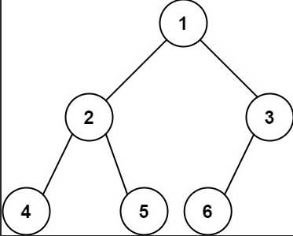
```
Input: root = [1,2,3,4,5,6]
Output: 6
```

**Example 2:**
```
Input: root = []
Output: 0
```

**Example 3:**
```
Input: root = [1]
Output: 1
```

**Constraints:**
```

    The number of nodes in the tree is in the range [0, 5 * 104].
    0 <= Node.val <= 5 * 104
    The tree is guaranteed to be complete.

```

[к оглавлению](#Tasks-from-leetcode)


## Leetcode Lesson 72

226 Invert Binary Tree
-
Given the `root` of a binary tree, invert the tree, and return its root.

**Example 1:**</br>
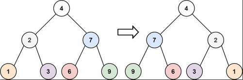</br>
```
Input: root = [4,2,7,1,3,6,9]
Output: [4,7,2,9,6,3,1]
```

**Example 2:**</br>
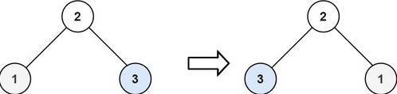</br>
```
Input: root = [2,1,3]
Output: [2,3,1]
```

**Example 3:**</br>
```
Input: root = []
Output: []
```

**Constraints:**
```
    The number of nodes in the tree is in the range [0, 100].
    -100 <= Node.val <= 100
```

[к оглавлению](#Tasks-from-leetcode)


## Leetcode Lesson 73

953 Verifying an Alien Dictionary
-
In an alien language, surprisingly, they also use English lowercase letters, but possibly in a different order. 
The order of the alphabet is some permutation of lowercase letters.
Given a sequence of words written in the alien language, and the order of the alphabet, return true if and only if the 
given words are sorted lexicographically in this alien language.


**Example 1:**</br>
```
Input: words = ["hello","leetcode"], order = "hlabcdefgijkmnopqrstuvwxyz"
Output: true
Explanation: As 'h' comes before 'l' in this language, then the sequence is sorted.
```

**Example 2:**</br>
</br>
```
Input: words = ["word","world","row"], order = "worldabcefghijkmnpqstuvxyz"
Output: false
Explanation: As 'd' comes after 'l' in this language, then words[0] > words[1], hence the sequence is unsorted.
```

**Example 3:**</br>
```
Input: words = ["apple","app"], order = "abcdefghijklmnopqrstuvwxyz"
Output: false
Explanation: The first three characters "app" match, and the second string is shorter (in size.) According to 
lexicographical rules "apple" > "app", because 'l' > '∅', where '∅' is defined as the blank character which is less 
than any other character (More info).
```

**Constraints:**
```
    1 <= words.length <= 100
    1 <= words[i].length <= 20
    order.length == 26
    All characters in words[i] and order are English lowercase letters.
```

[к оглавлению](#Tasks-from-leetcode)


## Leetcode Lesson 74

116 Populating Next Right Pointers in Each Node
-
You are given a `perfect binary tree` where all leaves are on the same level, and every parent has two children. 
The binary tree has the following definition:
```
struct Node {
  int val;
  Node *left;
  Node *right;
  Node *next;
}
```
Populate each next pointer to point to its next right node. If there is no next right node, 
the next pointer should be set to NULL.
Initially, all next pointers are set to NULL.

**Example 1:**</br>
</br>
```
Input: root = [1,2,3,4,5,6,7]
Output: [1,#,2,3,#,4,5,6,7,#]
Explanation: Given the above perfect binary tree (Figure A), your function should populate each next pointer to 
point to its next right node, just like in Figure B. The serialized output is in level order as connected by the next 
pointers, with '#' signifying the end of each level.
```

**Example 2:**</br>
```
Input: root = []
Output: []
```

**Constraints:**</br>
```
    The number of nodes in the tree is in the range [0, 212 - 1].
    -1000 <= Node.val <= 1000
```
Follow-up:
```
    You may only use constant extra space.
    The recursive approach is fine. You may assume implicit stack space does not count as extra space for this problem.
```

[к оглавлению](#Tasks-from-leetcode)


## Leetcode Lesson 75

2032 Two Out of Three
-
Given three integer arrays `nums1`, `nums2`, and `nums3`, return a *distinct* array containing all the values that are 
present in *at least two* out of the three arrays. You may return the values in *any* order.

**Example 1:**</br>
```
Input: nums1 = [1,1,3,2], nums2 = [2,3], nums3 = [3]
Output: [3,2]
Explanation: The values that are present in at least two arrays are:
- 3, in all three arrays.
- 2, in nums1 and nums2.
```

**Example 2:**</br>
```
Input: nums1 = [3,1], nums2 = [2,3], nums3 = [1,2]
Output: [2,3,1]
Explanation: The values that are present in at least two arrays are:
- 2, in nums2 and nums3.
- 3, in nums1 and nums2.
- 1, in nums1 and nums3.
```

**Example 3:**</br>
```
Input: nums1 = [1,2,2], nums2 = [4,3,3], nums3 = [5]
Output: []
Explanation: No value is present in at least two arrays.
```

**Constraints:**</br>
```
    1 <= nums1.length, nums2.length, nums3.length <= 100
    1 <= nums1[i], nums2[j], nums3[k] <= 100
```

[к оглавлению](#Tasks-from-leetcode)


## Leetcode Lesson 76

52 N-Queens II
-
The **n-queens** puzzle is the problem of placing `n` queens on an `n x n` chessboard such that no two queens attack 
each other.
Given an integer `n`, return the number of distinct solutions to the **n-queens puzzle**.

**Example 1:**</br>
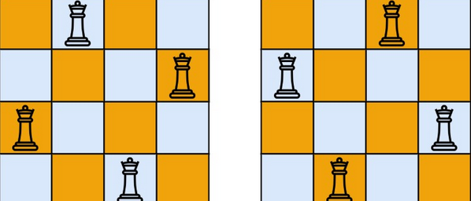</br>
```
Input: n = 4
Output: 2
Explanation: There are two distinct solutions to the 4-queens puzzle as shown.
```

**Example 2:**</br>
```
Input: n = 1
Output: 1
```

**Constraints:**</br>
```
    1 <= n <= 9
```

[к оглавлению](#Tasks-from-leetcode)


## Leetcode Lesson 77

146 LRU Cache
-
Design a data structure that follows the constraints of a Least Recently Used (LRU) cache.

Implement the LRUCache class:

- `LRUCache(int capacity)` Initialize the LRU cache with positive size `capacity`.
- `int get(int key)` Return the value of the key if the key exists, otherwise return `-1`.
- `void put(int key, int value)` Update the value of the `key` if the `key` exists. 
Otherwise, add the `key-value` pair to the cache. If the number of keys exceeds 
the `capacity` from this operation, evict the least recently used key.

The functions `get` and `put` must each run in `O(1)` average time complexity.

**Example 1:**
*Input*
```
["LRUCache", "put", "put", "get", "put", "get", "put", "get", "get", "get"]
[[2], [1, 1], [2, 2], [1], [3, 3], [2], [4, 4], [1], [3], [4]]
```
*Output*
```
[null, null, null, 1, null, -1, null, -1, 3, 4]
```

*Explanation*
```
LRUCache lRUCache = new LRUCache(2);
lRUCache.put(1, 1); // cache is {1=1}
lRUCache.put(2, 2); // cache is {1=1, 2=2}
lRUCache.get(1);    // return 1
lRUCache.put(3, 3); // LRU key was 2, evicts key 2, cache is {1=1, 3=3}
lRUCache.get(2);    // returns -1 (not found)
lRUCache.put(4, 4); // LRU key was 1, evicts key 1, cache is {4=4, 3=3}
lRUCache.get(1);    // return -1 (not found)
lRUCache.get(3);    // return 3
lRUCache.get(4);    // return 4
```

*Constraints:*
```
1 <= capacity <= 3000
0 <= key <= 104
0 <= value <= 105
At most 2 * 105 calls will be made to get and put.
```

[к оглавлению](#Tasks-from-leetcode)


## Leetcode Lesson 78

401 Binary Watch
-

A binary watch has 4 LEDs on the top to represent the hours (0-11), and 6 LEDs on the bottom to represent the minutes 
(0-59). Each LED represents a zero or one, with the least significant bit on the right.

- For example, the below binary watch reads "4:51".</br>

</br>

Given an integer `turnedOn` which represents the number of LEDs that are currently on (ignoring the PM), 
return all possible times the watch could represent. You may return the answer in any order.

The hour must not contain a leading zero.

- For example, "01:00" is not valid. It should be "1:00".

The minute must consist of two digits and may contain a leading zero.

- For example, "10:2" is not valid. It should be "10:02".

**Example 1:**
```
Input: turnedOn = 1
Output: ["0:01","0:02","0:04","0:08","0:16","0:32","1:00","2:00","4:00","8:00"]
```

**Example 2:**
```
Input: turnedOn = 9
Output: []
```

**Constraints:**
```
    0 <= turnedOn <= 10
```

[к оглавлению](#Tasks-from-leetcode)


## Leetcode Lesson 79

20 Valid Parentheses
-
Given a string s containing just the characters '(', ')', '{', '}', '[' and ']', determine if the input string is valid.

An input string is valid if:
1. Open brackets must be closed by the same type of brackets. 
2. Open brackets must be closed in the correct order. 
3. Every close bracket has a corresponding open bracket of the same type.

**Example 1:**
```
nput: s = "()"
Output: true
```

**Example 2:**
```
Input: s = "()[]{}"
Output: true
```

**Example 3:**
```
Input: s = "(]"
Output: false
```

**Constraints:**
```
    1 <= s.length <= 104
    s consists of parentheses only '()[]{}'.
```

[к оглавлению](#Tasks-from-leetcode)


## Leetcode Lesson 80

572 Subtree of Another Tree
-
Given the roots of two binary trees `root` and `subRoot`, return `true` if there is a subtree of `root` 
with the same structure and node values of subRoot and false otherwise.

A subtree of a binary tree `tree` is a tree that consists of a node in `tree` and all of this node's descendants. 
The tree `tree` could also be considered as a subtree of itself.

**Example 1:**</br>
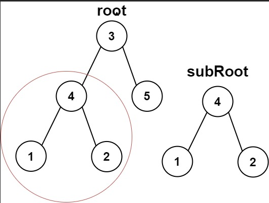</br>
```
Input: root = [3,4,5,1,2], subRoot = [4,1,2]
Output: true
```

**Example 2:**</br>
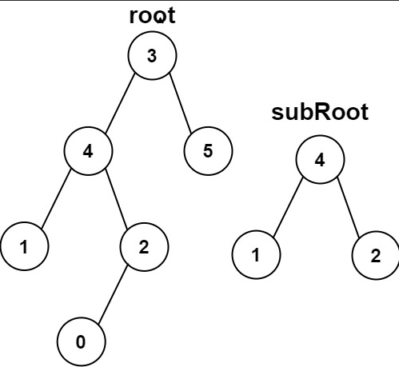</br>
```
Input: root = [3,4,5,1,2,null,null,null,null,0], subRoot = [4,1,2]
Output: false
```

**Constraints:**
```
    The number of nodes in the root tree is in the range [1, 2000].
    The number of nodes in the subRoot tree is in the range [1, 1000].
    -104 <= root.val <= 104
    -104 <= subRoot.val <= 104
```

[к оглавлению](#Tasks-from-leetcode)


## Leetcode Lesson 81

507 Perfect Number
-
A `perfect number` is a *positive integer* that is equal to the sum of its *positive divisors*, excluding 
the number itself. A divisor of an integer `x` is an integer that can divide `x` evenly.

Given an integer `n`, return `true` if `n` is a perfect number, otherwise return `false`.

**Example 1:**
```
Input: num = 28
Output: true
Explanation: 28 = 1 + 2 + 4 + 7 + 14
1, 2, 4, 7, and 14 are all divisors of 28.
```

**Example 2:**
```
Input: num = 7
Output: false
```

**Constraints:**
```
1 <= num <= 108
```

[к оглавлению](#Tasks-from-leetcode)


## Leetcode Lesson 82

643 Maximum Average Subarray I
-
You are given an integer array `nums` consisting of `n` elements, and an integer `k`.

Find a contiguous subarray whose length is equal to `k` that has the maximum average value and return this value. 
Any answer with a calculation error less than `10^5` will be accepted.

**Example 1:**
```
Input: nums = [1,12,-5,-6,50,3], k = 4
Output: 12.75000
Explanation: Maximum average is (12 - 5 - 6 + 50) / 4 = 51 / 4 = 12.75
```

**Example 2:**
```
Input: nums = [5], k = 1
Output: 5.00000
```

**Constraints:**
```
    n == nums.length
    1 <= k <= n <= 105
    -104 <= nums[i] <= 104
```

[к оглавлению](#Tasks-from-leetcode)


## Leetcode Lesson 83

142 Linked List Cycle II
-
Given the `head` of a linked list, return the node where the cycle begins. If there is no cycle, return `null`.
There is a cycle in a linked list if there is some node in the list that can be reached again by continuously 
following the next pointer. Internally, `pos` is used to denote the index of the node that tail's `next` pointer 
is connected to (0-indexed). It is `-1` if there is no cycle. Note that `pos` is not passed as a parameter.

Do not modify the linked list.

**Example 1:**</br>
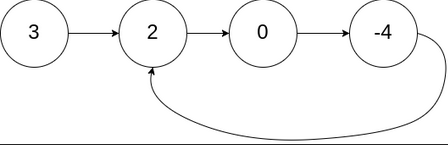</br>
```
Input: head = [3,2,0,-4], pos = 1
Output: tail connects to node index 1
Explanation: There is a cycle in the linked list, where tail connects to the second node.
```


**Example 2:**</br>
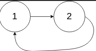</br>
```
Input: head = [1,2], pos = 0
Output: tail connects to node index 0
Explanation: There is a cycle in the linked list, where tail connects to the first node.
```


**Example 3:**</br>
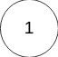</br>
```
Input: head = [1], pos = -1
Output: no cycle
Explanation: There is no cycle in the linked list.
```


**Constraints:**
```
    The number of the nodes in the list is in the range [0, 104].
    -105 <= Node.val <= 105
    pos is -1 or a valid index in the linked-list.
```
**Follow up:** Can you solve it using O(1) (i.e. constant) memory?

Code: [142. Linked List Cycle II]

[к оглавлению](#Tasks-from-leetcode)


## Leetcode Lesson 84

108 Convert Sorted Array to Binary Search Tree
-
Given an integer array `nums` where the elements are sorted in *ascending order*, convert it to a
height-balanced binary search tree.

**Example 1:**</br>
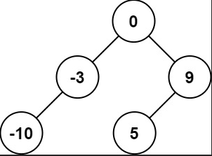</br>
```
Input: nums = [-10,-3,0,5,9]
Output: [0,-3,9,-10,null,5]
Explanation: [0,-10,5,null,-3,null,9] is also accepted:
```
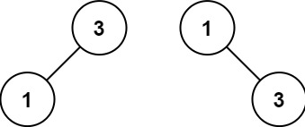</br>

**Example 2:**</br>
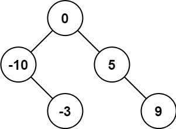</br>
```
Input: nums = [1,3]
Output: [3,1]
Explanation: [1,null,3] and [3,1] are both height-balanced BSTs.
```

**Constraints:**
```
    1 <= nums.length <= 104
    -104 <= nums[i] <= 104
    nums is sorted in a strictly increasing order.
```


Code: [108. Convert Sorted Array to Binary Search Tree]

[к оглавлению](#Tasks-from-leetcode)
