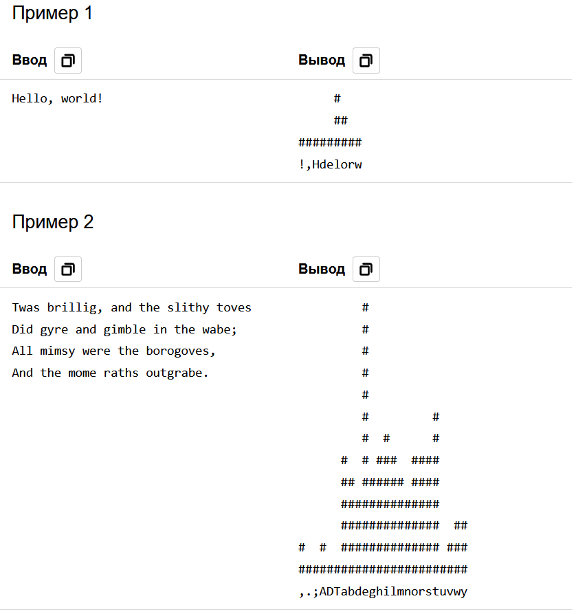
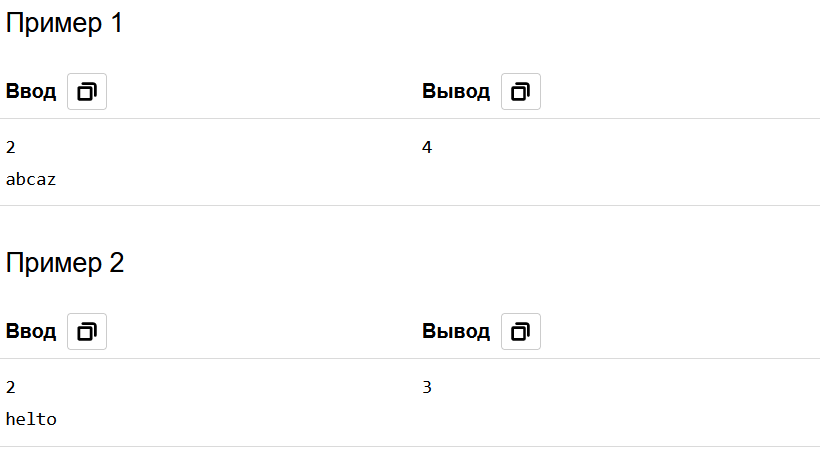
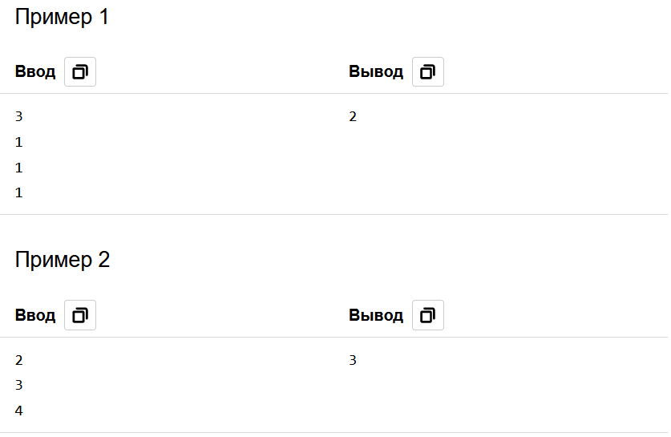
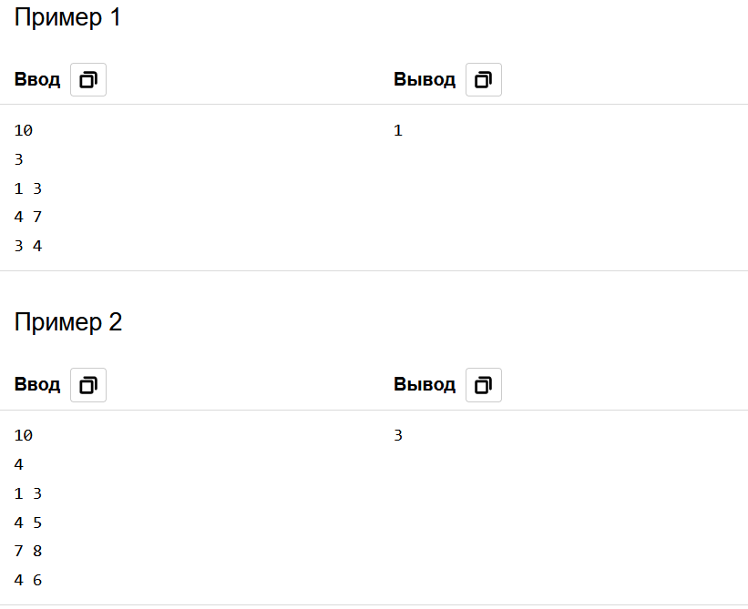

# Yandex

Training on algorithms 3.0 from Yandex

+ [Lesson 1. Histogram](#Yandex-Lesson-1) ![icon][done]
+ [Lesson 2. Beautiful string](#Yandex-Lesson-2) ![icon][done]
+ [Lesson 3. Collector Diego](#Yandex-Lesson-3) ![icon][done]
+ [Lesson 4. Verification work](#Yandex-Lesson-4) ![icon][done]
+ [Lesson 5. A good line](#Yandex-Lesson-5) ![icon][done]
+ [Lesson 6. Lite operating systems](#Yandex-Lesson-6) ![icon][done]
+ [Lesson 7. SNTP](#Yandex-Lesson-7) ![icon][done]

[Список разделов](README.md)

[done]:src/main/resources/image/done.png

## Yandex Lesson 1

Гистограмма
-

Вовочка ломает систему безопасности Пентагона. Для этого ему понадобилось узнать, какие символы в секретных 
зашифрованных посланиях употребляются чаще других. Для удобства изучения Вовочка хочет получить графическое 
представление встречаемости символов. Поэтому он хочет построить гистограмму количества символов в сообщении. 
Гистограмма — это график, в котором каждому символу, встречающемуся в сообщении хотя бы один раз, соответствует 
столбик, высота которого пропорциональна количеству этих символов в сообщении.

### Формат ввода

Входной файл содержит зашифрованный текст сообщения. Он содержит строчные и прописные латинские буквы, цифры, 
знаки препинания («.», «!», «?», «:», «-», «,», «;», «(», «)»), пробелы и переводы строк. 
Размер входного файла не превышает 10000 байт. Текст содержит хотя бы один непробельный символ. 
Все строки входного файла не длиннее 200 символов.Для каждого символа c кроме пробелов и переводов строк выведите 
столбик из символов «#», количество которых должно быть равно количеству символов c в данном тексте. Под каждым 
столбиком напишите символ, соответствующий ему. Отформатируйте гистограмму так, чтобы нижние концы столбиков были 
на одной строке, первая строка и первый столбец были непустыми. Не отделяйте столбики друг от друга. 
Отсортируйте столбики в порядке увеличения кодов символов. 

### Формат вывода

Для каждого символа c кроме пробелов и переводов строк выведите столбик из символов «#», количество которых должно быть 
равно количеству символов c в данном тексте. Под каждым столбиком напишите символ, соответствующий ему. Отформатируйте 
гистограмму так, чтобы нижние концы столбиков были на одной строке, первая строка и первый столбец были непустыми. 
Не отделяйте столбики друг от друга. Отсортируйте столбики в порядке увеличения кодов символов. 

[к оглавлению](#Tasks-from-yandex)

## Yandex Lesson 2

Красивая строка
-

Красотой строки назовем максимальное число идущих подряд одинаковых букв. (красота строки abcaabdddettq равна 3)
Сделайте данную вам строку как можно более красивой, если вы можете сделать не более k операций замены символа. 

### Формат ввода

В первой строке записано одно целое число `k` `(0 ≤ k ≤ 10^9)`
Во второй строке дана непустая строчка `S` `(|S| ≤ 2 ⋅ 10^5)`. Строчка `S` состоит только из маленьких латинских букв. 

### Формат вывода

[к оглавлению](#Tasks-from-yandex)

## Yandex Lesson 3

Коллекционер Диего
-

Диего увлекается коллекционированием наклеек. На каждой из них написано число, и каждый коллекционер мечтает собрать 
наклейки со всеми встречающимися числами.
Диего собрал N наклеек, некоторые из которых, возможно, совпадают. Как-то раз к нему пришли K коллекционеров. 
i-й из них собрал все наклейки с номерами не меньшими, чем pi. Напишите программу, которая поможет каждому из 
коллекционеров определить, сколько недостающих ему наклеек есть у Диего. Разумеется, гостей Диего не интересуют 
повторные экземпляры наклеек.

### Формат ввода

В первой строке содержится единственное число `N` `(0 ≤ N ≤ 100 000)` — количество наклеек у Диего.
В следующей строке содержатся `N` целых неотрицательных чисел (не обязательно различных) — номера наклеек Диего. 
Все номера наклеек не превосходят 10^9.
В следующей строке содержится число `K` `(0 ≤ K ≤ 100 000)` — количество коллекционеров, пришедших к Диего. 
В следующей строке содержатся K целых чисел `p i-ое` `(0 ≤ pi ≤ 10^9)`, где p i-ое — наименьший номер наклейки, 
не интересующий i-го коллекционера.

### Формат вывода
Для каждого коллекционера в отдельной строке выведите количество различных чисел на наклейках, которые есть у Диего, 
но нет у этого коллекционера.

[к оглавлению](#Tasks-from-yandex)

## Yandex Lesson 4

Контрольная работа
-

Петя и Вася — одноклассники и лучшие друзья, поэтому они во всём помогают друг другу. Завтра у них контрольная 
по математике, и учитель подготовил целых K вариантов заданий.
В классе стоит один ряд парт, за каждой из них (кроме, возможно, последней) на контрольной будут сидеть ровно два 
ученика. Ученики знают, что варианты будут раздаваться строго по порядку: правый относительно учителя ученик первой 
парты получит вариант 1, левый — вариант 2, правый ученик второй парты получит вариант 3 
(если число вариантов больше двух) и т.д. Так как K может быть меньше чем число учеников N, то после варианта K снова 
выдаётся вариант 1. На последней парте в случае нечётного числа учеников используется только место 1. 

Петя самым первым вошёл в класс и сел на своё любимое место. Вася вошёл следом и хочет получить такой же вариант, 
что и Петя, при этом сидя к нему как можно ближе. То есть между ними должно оказаться как можно меньше парт, а при 
наличии двух таких мест с равным расстоянием от Пети Вася сядет позади Пети, а не перед ним. Напишите программу, 
которая подскажет Васе, какой ряд и какое место (справа или слева от учителя) ему следует выбрать. 
Если же один и тот же вариант Вася с Петей писать не смогут, то выдайте одно число -1.

### Формат ввода
В первой строке входных данных находится количество учеников в классе `2 ≤ N ≤ 10^9`. Во второй строке — 
количество подготовленных для контрольной вариантов заданий `2 ≤ K ≤ N`. В третьей строке — номер ряда, на который уже 
сел Петя, в четвёртой — цифра 1, если он сел на правое место, и 2, если на левое.

### Формат вывода

Если Вася никак не сможет писать тот же вариант, что и Петя, то выведите -1. Если решение существует, 
то выведите два числа — номер ряда, на который следует сесть Васе, и 1, если ему надо сесть на правое место, или 2, 
если на левое. Разрешается использовать только первые N мест в порядке раздачи вариантов. 

### Примечания

В первом примере вариантов 2, поэтому наилучшее место для Васи находится сразу за Петей. 
Во втором примере Петя будет единственным, кто получит вариант 13. 

[к оглавлению](#Tasks-from-yandex)

## Yandex Lesson 5

Хорошая строка
-

На день рождения маленький Ипполит получил долгожданный подарок — набор дощечек с написанными на них буквами латинского 
алфавита. Теперь-то ему будет чем заняться долгими вечерами, тем более что мама обещала подарить ему в следующем 
году последовательность целых неотрицательных чисел, если он хорошо освоит этот набор. Ради такого богатства Ипполит 
готов на многое. Прямо сейчас юный исследователь полностью поглощён изучением хорошести строк. Хорошестью строки 
называется количество позиций от `1` до `L-1` (где L — длина строки), таких, что следующая буква в строке является 
следующей по алфавиту. Например, хорошесть строки `abcdefghijklmnopqrstuvwxyz` равна 25, а строки "abdc" — только `1`.

Ипполит размышляет над решением закономерно возникающей задачи: чему равна максимально возможная хорошесть строки, 
которую можно собрать, используя дощечки из данного набора? Вы-то и поможете ему с ней справиться.

### Формат ввода

Первая строка ввода содержит единственное целое число `N` — количество различных букв в наборе `(1 ≤ N ≤ 26)`. 
Обратите внимание: в наборе всегда используются N первых букв латинского алфавита.
Следующие N строк содержат целые положительные числа ci — количество букв соответствующего типа `(1≤c i-ое≤109)`. 
Таким образом, первое число означает количество букв `a`, второе число задаёт количество букв `b` и так далее.

### Формат вывода

Выведите единственное целое число — максимально возможную хорошесть строки, которую можно собрать из имеющихся дощечек.

### Примечания

В первом тесте имеется по одной дощечке с каждой из 3 различных букв. Ответ 2 достигается на строке `abc`

[к оглавлению](#Tasks-from-yandex)

## Yandex Lesson 6

Операционные системы lite
-

Васин жесткий диск состоит из M секторов. Вася последовательно устанавливал на него различные операционные системы 
следующим методом: он создавал новый раздел диска из последовательных секторов, начиная с сектора номер a i-ое и до сектора 
bi включительно, и устанавливал на него очередную систему. При этом, если очередной раздел хотя бы по одному сектору 
пересекается с каким-то ранее созданным разделом, то ранее созданный раздел «затирается», и операционная система, 
которая на него была установлена, больше не может быть загружена.
Напишите программу, которая по информации о том, какие разделы на диске создавал Вася, определит, сколько в итоге 
работоспособных операционных систем установлено и работает в настоящий момент на Васином компьютере.

### Формат ввода

Сначала вводятся натуральное число `M` — количество секторов на жестком диске `(1 ≤ M ≤ 109)` и целое число 
`N` — количество разделов, которое последовательно создавал Вася (0 ≤ N ≤ 1000).
Далее идут `N` пар чисел a i-ое и b i-ое, задающих номера начального и конечного секторов раздела `(1 ≤ ai ≤ bi ≤ M)`.

### Формат вывода

Выведите одно число — количество работающих операционных систем на Васином компьютере.

[к оглавлению](#Tasks-from-yandex)

## Yandex Lesson 7

SNTP
-

Для того чтобы компьютеры поддерживали актуальное время, они могут обращаться к серверам точного времени SNTP 
(Simple Network Time Protocol). К сожалению, компьютер не может просто получить время у сервера, потому что информация 
по сети передаётся не мгновенно: пока сообщение с текущим временем дойдёт до компьютера, оно потеряет свою актуальность. 
Протокол взаимодействия клиента (компьютера, запрашивающего точное время) и сервера (компьютера, выдающего точное время) 
выглядит следующим образом:
1. Клиент отправляет запрос на сервер и запоминает время отправления `A` (по клиентскому времени).
2. Сервер получает запрос в момент времени B (по точному серверному времени) и отправляет клиенту сообщение, содержащее 
время `B`.
3. Клиент получает ответ на свой запрос в момент времени C (по клиентскому времени) и запоминает его. Теперь клиент, 
из предположения, что сетевые задержки при передаче сообщений от клиента серверу и от сервера клиенту одинаковы, может 
определить и установить себе точное время, используя известные значения `A`, `B`, `C`.
Вам предстоит реализовать алгоритм, с точностью до секунды определяющий точное время для установки на клиенте по 
известным `A`, `B` и `C`. При необходимости округлите результат до целого числа секунд по правилам арифметики (в меньшую 
сторону, если дробная часть числа меньше 1/2, иначе в большую сторону).
Возможно, что, пока клиент ожидал ответа, по клиентскому времени успели наступить новые сутки, однако известно, 
что между отправкой клиентом запроса и получением ответа от сервера прошло менее 24 часов.

### Формат ввода

Программа получает на вход три временные метки `A`, `B`, `C`, по одной в каждой строке. 
Все временные метки представлены в формате `«hh:mm:ss»`, где `«hh»` – это часы, `«mm»` – минуты, `«ss»` – секунды. 
Часы, минуты и секунды записываются ровно двумя цифрами каждое (возможно, с дополнительными нулями в начале числа).

### Формат вывода

Программа должна вывести одну временную метку в формате, описанном во входных данных, – вычисленное точное время для 
установки на клиенте. В выводе не должно быть пробелов, пустых строк в начале вывода. 

